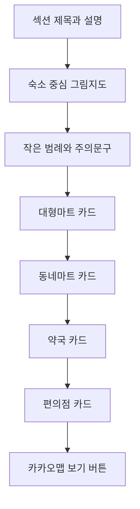
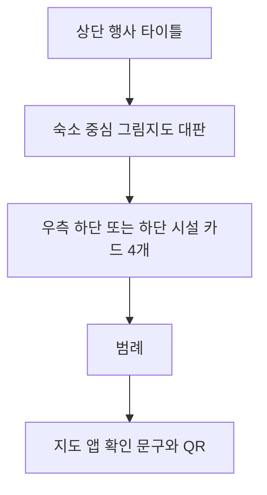
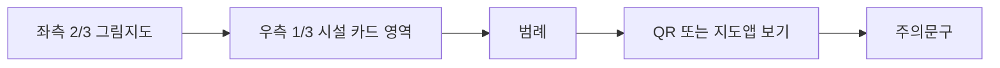

# 안티그래비티용 그림지도 프롬프트 설계 보고서

## Executive summary

이번 과제에 가장 적합한 결과물은 **실제 지도 타일을 그대로 캡처한 화면**이 아니라, **숙소를 중심으로 필요한 편의시설만 추려서 보여주는 하이브리드 일러스트 약도**입니다. 국내 행사·전시장 안내 사례를 보면, 웹에서는 길찾기와 편의시설 탐색을 위한 인터랙티브 안내를 제공하고, 인쇄물이나 공지 이미지에서는 부스·주차·시설을 빠르게 이해할 수 있도록 단순화된 약도나 구역도를 별도로 배포하는 패턴이 반복됩니다. 서울시의 최근 공공디자인 체크리스트도 복잡한 지침을 빠르게 이해시키기 위해 대규모 일러스트·도식화 방식을 채택하고 있어, 기업 단합대회 안내물에 그림지도를 쓰는 방향은 충분히 실무적입니다. citeturn17view0turn17view2turn15image0turn15image2turn11view1turn14search0

제공된 HTML은 이미 이 방향에 필요한 핵심 토대를 갖고 있습니다. 블루·네이비 중심의 브랜드 톤, 라운드 카드와 소프트 섀도우, `Pretendard` 계열 산세리프, 모바일 반응형 breakpoints, 그리고 `숙소 주변 편의시설` 섹션의 **지도 영역 + 카드 목록** 구조가 이미 정의돼 있습니다. 다만 현재 nearby 섹션에는 **정확한 위경도, 실제 편의시설 명칭, 전화번호, 영업시간**이 없고, 각 카드의 거리·시간도 모두 `지도 기준 확인 필요` 상태입니다. 또한 Kakao Maps JavaScript SDK는 주석으로만 남아 있어 실제 키/도메인 설정이 완료되지 않았습니다. 따라서 안티그래비티 프롬프트는 반드시 **“숙소 주소로 지오코딩 필요”**, **“전화/영업시간은 HTML에서 추출 가능할 때만 표시”**, **“없으면 숨기거나 지도 앱 확인 문구로 대체”**라는 조건을 포함해야 합니다. fileciteturn0file0L8-L30 fileciteturn0file0L720-L742 fileciteturn0file0L1040-L1127 fileciteturn0file0L1327-L1330 citeturn3view5turn6view0turn21view1

기술 스택은 **카카오맵 우선**이 가장 자연스럽습니다. 현재 HTML 자체가 Kakao deep-link를 사용하고 있고, 공식 문서상 Kakao Maps JS는 반응형 지도 생성과 리사이즈 후 `relayout()`, 클릭 가능한 `CustomOverlay`, 마커-연동 `InfoWindow`, 주소→좌표 변환 `Geocoder`, 그리고 중심좌표·반경 기반의 키워드/카테고리 검색을 지원합니다. 네이버 지도도 `SymbolIcon`, 커스텀 `InfoWindow`, Geocoder, Static Map을 제공하므로 대안이 되지만, 이번 산출물은 기존 HTML과의 연속성을 위해 **Kakao JS + Kakao Local API를 기본 권장안**, Naver를 **대체 구현안**으로 잡는 편이 가장 덜 복잡합니다. citeturn4view4turn3view1turn20view1turn3view5turn6view0turn21view1turn2view2turn2view3turn8view0turn7search6

## 제공된 HTML에서 확인된 구현 전제

제공된 파일을 기준으로 보면, 이번 그림지도 프롬프트는 **새 페이지를 처음부터 만드는 작업**이 아니라, 기존 nearby 섹션을 **그림지도형으로 업그레이드하는 작업**에 가깝습니다. HTML에는 이미 행사 전체가 네이비·블루 중심 톤으로 설계되어 있고, 아이콘도 라인 스타일 SVG 심볼로 통일되어 있으며, 모바일 반응형과 인쇄용 최소 스타일도 일부 반영되어 있습니다. nearby 섹션은 `지도 영역`, `fallback 버튼`, `편의시설 카드`, `실제 영업시간과 경로는 지도 앱에서 최종 확인` 문구까지 포함하고 있으므로, 새 프롬프트는 **이 정보 구조를 유지한 채 시각 언어만 그림지도 방식으로 전환**해야 합니다. fileciteturn0file0L11-L30 fileciteturn0file0L54-L62 fileciteturn0file0L720-L742 fileciteturn0file0L1040-L1127

아래 표는 현재 HTML에서 **바로 가져올 수 있는 데이터**와 **추가 확보가 필요한 데이터**를 정리한 것입니다. 표의 값은 제공된 HTML 자체를 바탕으로 정리했습니다. fileciteturn0file0L1040-L1127 fileciteturn0file0L1327-L1330

| 항목 | 현재 HTML에서 확보 가능 | 그림지도 프롬프트에서의 처리 |
|---|---|---|
| 섹션 제목 | `숙소 주변 편의시설` | 그대로 유지 |
| 설명문 | `숙소를 기준으로 도착 후 바로 필요한 편의시설을 지도에서 확인할 수 있습니다.` | 그대로 유지 |
| 숙소 텍스트 주소 | `군산수송제일오투그란데1단지아파트 306동`이 카카오맵 질의 링크에 반복 표기됨 | **숙소 주소로 지오코딩 필요**로 명시 |
| 시설 분류 | 대형마트 / 동네마트 / 약국 / 편의점 | 그림지도 마커 + 카드 연동 대상으로 사용 |
| 시설 설명 | 각 카드별 짧은 설명 존재 | 팝업과 카드 서브텍스트로 재사용 |
| 거리·시간 | 모두 `지도 기준 확인 필요` | API 또는 수동 보강 전까지 placeholder 유지 |
| 실제 시설명 | 없음 | 보강 데이터 없으면 generic category만 사용 |
| 전화번호 | 없음 | HTML 추출 시만 표시, 없으면 숨김 |
| 영업시간 | 없음 | HTML 추출 시만 표시, 없으면 `지도 앱에서 확인` |
| 실지도 SDK | 주석 처리된 Kakao SDK만 존재 | 앱 키·플랫폼 키·도메인 등록 후 활성화 |
| 인쇄 레이아웃 | 전역 `@media print` 최소 설정만 존재 | **전용 인쇄 템플릿 2종** 별도 생성 필요 |

실무적으로 특히 중요한 점은 두 가지입니다. 첫째, 현재 파일에는 숙소 위치 deep-link는 있어도 **독립된 `lat/lng` 데이터 필드가 없으므로**, 생성 프롬프트에서 무리하게 좌표를 고정하지 말고 `숙소 주소로 지오코딩 필요`라고 적는 편이 안전합니다. 둘째, nearby 카드에 전화번호·영업시간이 없으므로, 프롬프트 안에서 이를 “반드시 출력”으로 쓰면 툴이 근거 없이 값을 지어낼 가능성이 있습니다. 그래서 **“HTML에서 추출 가능하면 포함, 아니면 숨김 또는 확인 필요 문구”**라는 조건문이 필수입니다. fileciteturn0file0L1058-L1127 citeturn3view5turn6view0

## 조사 결과와 적용 방향

**국내 행사 안내 사례의 공통점**은 웹과 인쇄물의 역할을 분리한다는 점입니다. 코엑스는 공식 사이트에서 PC·모바일용 실내 길찾기를 제공하고, 가이드 메뉴를 `오시는 길`, `실내 길찾기`, `주차안내`, `편의시설`로 분리해 사용자 과업에 맞춰 탐색하게 합니다. 반면 컨퍼런스 archive나 공지 이미지에서는 행사 리플렛, 부스 배치도, 주차 안내도 같은 **단순화된 도식형 맵**을 별도 자산으로 배포합니다. 즉, **웹은 탐색**, **인쇄/공지 이미지는 즉시 이해**가 핵심입니다. 숙소 주변 편의시설 그림지도도 이 원칙에 맞춰, 웹에서는 클릭·연동을 살리고 인쇄본에서는 한 장 안에 이해가 끝나도록 재구성하는 것이 맞습니다. citeturn17view0turn17view2turn15image0turn15image2

**아이콘과 심볼은 표준 인지성을 우선**해야 합니다. 국가기술표준원은 공공안내 그래픽 심볼 표준의 목적을 “언어·국가·민족·문화 차이와 관계없이 누구나 쉽게 인식”하도록 하는 데 두고 있으며, 디자이너가 표준에 부합하는 그래픽 심볼을 사용해 혼란을 최소화해야 한다고 설명합니다. 또 서울시는 공공디자인 체크리스트를 97종 항목과 42개 도시 장면으로 **일러스트화**해, 텍스트만으로는 한 번에 이해하기 어려운 지침을 도식화했습니다. 이 두 자료를 합치면, 이번 그림지도는 “예쁜 일러스트”보다도 **즉시 인지 가능한 심볼 체계 + 텍스트를 덜 읽게 만드는 도식화**가 핵심이라는 결론이 나옵니다. citeturn11view0turn11view1

**웹 구현 기술은 카카오 우선, 네이버 대안**이 합리적입니다. Kakao Maps JS는 지도 생성, 리사이즈 후 `relayout()`, 클릭 가능한 `CustomOverlay`, 마커와 함께 열 수 있는 `InfoWindow`를 지원하고, InfoWindow/Overlay 콘텐츠에 HTML 문자열이나 DOM을 쓸 수 있습니다. Naver Maps도 `Marker`에 이미지 아이콘뿐 아니라 `SymbolIcon`을 쓸 수 있고, `InfoWindow` 콘텐츠를 DOM/CSS로 자유롭게 꾸밀 수 있습니다. 따라서 **카드 클릭 ↔ 마커 강조 ↔ 팝업 오픈** 같은 패턴은 두 플랫폼 모두 가능하지만, 이번 파일이 이미 카카오 링크와 카카오 SDK 주석을 갖고 있다는 점에서 기본 구현은 카카오가 더 자연스럽습니다. citeturn4view4turn20view1turn3view1turn2view2turn2view3

**데이터 보강 방식은 지오코딩 + 주변 검색**이 정석입니다. Kakao Maps `services.Geocoder`는 주소→좌표, 좌표→주소 변환을 제공하고, Local API의 키워드 검색과 카테고리 검색은 중심 좌표와 반경을 기준으로 장소를 조회할 수 있습니다. 공식 응답 예시에는 `place_name`, `distance`, `place_url`, `address_name`, `road_address_name`, `phone`, `x`, `y`가 포함됩니다. 반대로, 현재 HTML nearby 카드에는 시설명 카테고리와 설명만 있고 이 상세값이 없습니다. 따라서 **그래픽 프롬프트 자체는 generic category 기반으로 시작하되, 데이터가 들어오면 시설명·도보분·전화번호를 자동 반영하고, 데이터가 없으면 generic card로 남기는 조건부 설계**가 가장 안전합니다. 운영시간은 제공 HTML에도 없고, 인용한 Kakao 공식 응답 예시에서도 보장 필드로 확인되지 않으므로 optional로 두는 편이 맞습니다. fileciteturn0file0L1066-L1124 citeturn3view5turn6view0

**인쇄용 출력은 지도 스크린샷이 아니라 벡터 우선 PDF**로 가야 합니다. Kakao `StaticMap`은 중심 좌표·레벨·마커를 가진 이미지 지도를 만들 수 있고, NAVER Static Map도 자바스크립트 없이 지정 좌표 중심의 지도 이미지를 불러오는 방식입니다. 하지만 Adobe는 인쇄용 PDF 변환에서 `PDF/X-4`를 press-ready 형식으로 제시하고, InDesign/Illustrator 문서에서도 PDF/X-4를 신뢰할 수 있는 인쇄 워크플로로 권장합니다. 따라서 실무적으로는 **지도 API 정적 이미지를 검증용 베이스로 쓰고, 최종 인쇄본은 텍스트와 도형을 살아있는 벡터로 유지한 그림지도 PDF/X-4**로 내보내는 것이 맞습니다. 이는 API 이미지를 최종본으로 박는 방식보다 확대·축소와 인쇄 안정성이 훨씬 좋다는 **실무적 추론**입니다. citeturn4view2turn7search6turn19search2turn19search7turn19search19

**접근성 측면에서는 그림과 텍스트를 분리**해야 합니다. W3C WCAG 2.2는 일반 텍스트와 이미지 텍스트에 대해 최소 4.5:1 대비를 요구하고, 기술적으로 가능하다면 정보를 전달하는 내용을 “이미지의 텍스트”가 아니라 실제 텍스트로 제공하라고 안내합니다. 따라서 `숙소`, `대형마트`, `도보 5분`, `지도 앱에서 확인` 같은 핵심 정보는 PNG 배경 안에 녹여 넣기보다 SVG 텍스트나 HTML 텍스트 레이어로 남기는 편이 옳습니다. 카드 목록을 병행해서 두는 것도, 그림지도가 시각적으로 정보를 주더라도 텍스트 대안을 함께 제공하는 안전한 방식입니다. citeturn12search0turn12search2turn12search5

온라인 사례 링크를 실무적으로 참고하려면, **코엑스 실내 길찾기**는 모바일/PC 길찾기 플로우를, **서울 관광지도 & 가이드북**은 공공기관의 공식 지도·가이드북 배포 패턴을, **국제 전자전 컨퍼런스 리플렛 archive**는 행사 리플렛 자산 배포 방식을, **인천수의컨퍼런스 공지 이미지**는 부스·주차 안내도를 참고하면 좋습니다. 모두 이번 과제의 “웹 반응형 + 인쇄용 한 장 그림지도” 구조를 설계할 때 직접적인 감각을 줍니다. citeturn17view0turn14search0turn17view2turn15image0turn15image2

## 안티그래비티용 완성형 프롬프트

아래 프롬프트는 **현재 제공된 HTML 구조를 기반으로**, 안티그래비티에 바로 붙여 넣을 수 있도록 작성했습니다. nearby 섹션의 정보 구조를 유지하면서, 결과물을 **그림지도형 일러스트 버전**으로 재구성하는 데 초점을 맞췄습니다. nearby 섹션의 generic 데이터 구조, 기존 브랜드 톤, 카카오맵 fallback 패턴, 그리고 좌표·전화·영업시간 미보유 상태를 반영했습니다. fileciteturn0file0L1040-L1127 fileciteturn0file0L1327-L1330 citeturn3view5turn6view0turn21view1

```plaintext
프로젝트명:
기업 단합대회 안내페이지용 숙소 주변 편의시설 그림지도 섹션 제작

목표:
제공된 HTML 구조의 “숙소 주변 편의시설” 섹션을
실제 지도 스크린샷이 아닌, 기업 행사 안내물에 어울리는
일러스트 약도(그림지도) 버전으로 재구성한다.

핵심 목적:
- 숙소를 기준으로 도착 직후 필요한 편의시설을 한눈에 보여준다.
- 모바일 웹과 인쇄용 고해상도 PDF 모두에서 자연스럽게 사용 가능해야 한다.
- 기존 HTML의 카드 구조와 연동되어 클릭 시 정보 팝업이 열려야 한다.
- 숙소를 가장 강하게 강조하고, 편의시설은 심볼(아이콘) 기반 마커로 표현한다.

입력 데이터 기준:
- 섹션 제목: 숙소 주변 편의시설
- 섹션 설명: 숙소를 기준으로 도착 후 바로 필요한 편의시설을 지도에서 확인할 수 있습니다.
- 숙소 주소 텍스트: 군산수송제일오투그란데1단지아파트 306동
- 숙소 정확 좌표: 숙소 주소로 지오코딩 필요
- 편의시설 분류:
  1) 대형마트 — 장보기, 음료, 간식 구매
  2) 동네마트 — 간단한 생필품과 간식 구매
  3) 약국 — 상비약, 멀미약, 소화제 등 긴급 구매
  4) 편의점 — 음료, 간식, 간단한 생필품 구매
- HTML에 실제 시설명/영업시간/전화번호가 있으면 추출해서 사용
- HTML에 해당 정보가 없으면 절대 임의 생성하지 말고:
  - 시설명은 카테고리명 중심 generic label 유지
  - 영업시간은 “지도 앱에서 확인”
  - 전화번호는 숨김
  - 거리/도보 분은 “도보 시간 산출 필요” 또는 데이터 연동 시 근사치 출력

출력 결과:
반드시 아래 3종 산출물을 한 번에 생성한다.
1) 반응형 웹 섹션
2) 인쇄용 A4 세로 1페이지 템플릿
3) 인쇄용 A4 가로 1페이지 템플릿

디자인 방향:
- 기업 단합대회 / 세미나 / 워크숍 안내물에 어울리는 신뢰감 있는 톤
- 블루·네이비 중심 브랜드 무드
- 보조 강조색은 teal 계열을 사용하되 과도하게 화려하지 않게 절제
- 밝은 화이트/소프트 블루 배경
- 라인 스타일 아이콘과 단정한 라운드 카드 UI
- 지나치게 귀엽거나 관광엽서처럼 과한 캐릭터성은 금지
- 실제 위치 감각은 유지하되, 화면은 회의자료/행사안내용 인포그래픽처럼 정돈

그림지도 표현 규칙:
- 지도 배경은 실제 도로 구조를 단순화한 벡터 일러스트 스타일로 표현
- 숙소를 중심점으로 두고, 주요 도로/교차로/생활 동선만 남긴다
- 불필요한 지형·상호·점포 밀집 정보는 생략한다
- “숙소”는 가장 큰 메인 심볼로 강조한다
  - home 또는 lodging 심볼
  - 메인 컬러 halo / label / outline 적용
- 편의시설 마커는 번호 + 심볼 조합으로 표현한다
  - 대형마트: cart / basket 계열 심볼
  - 동네마트: bag / small mart 계열 심볼
  - 약국: medical cross / pharmacy 계열 심볼
  - 편의점: convenience / 24h bag 계열 심볼
- 각 마커 옆에는 짧은 한국어 라벨을 붙인다
- 지도 오른쪽 아래 또는 하단에 작은 범례를 넣는다
- 북쪽 화살표는 작게, 축척은 단순화해서 표시할 수 있다
- 지도 타일 화면 캡처처럼 보이지 않게, 벡터 드로잉 느낌으로 제작한다

레이아웃 규칙:
[웹 데스크톱]
- 좌측 60~65%: 그림지도
- 우측 35~40%: 편의시설 카드 목록
- 카드 클릭 시 해당 마커 하이라이트 + 팝업 오픈
- 마커 클릭 시 해당 카드 active state + 팝업 오픈
- 지도 아래에는 주의문구와 “카카오맵에서 보기” 보조 버튼을 둔다

[모바일]
- 제목/설명
- 그림지도
- 범례/주의문구
- 카드 리스트
순서로 세로 배치
- 카드 터치 시 팝업/상세정보가 열리고, 지도 상의 해당 마커가 깜빡이거나 강조된다

[인쇄용 A4 세로]
- 상단 제목 영역
- 중앙에 큰 그림지도
- 하단 또는 우측 하단에 4개 시설 카드 압축 배치
- 하단 여백에 주의문구 + QR 또는 지도앱 보기 안내

[인쇄용 A4 가로]
- 좌측 2/3 그림지도
- 우측 1/3 카드 + 범례 + 요약 정보
- 행사 안내문에 끼워 넣기 쉬운 깔끔한 1장 구도

카드/팝업 규칙:
각 시설 카드와 지도 팝업에는 아래 우선순위로 정보를 배치한다.
- 카테고리명 또는 실제 시설명
- 한 줄 설명
- 숙소 기준 도보 시간(가능하면)
- 영업시간(HTML에 있으면)
- 전화번호(HTML에 있으면)
- 버튼: 지도에서 보기

기본 문구 규칙:
- 실제 거리 및 이동 시간은 데이터가 없으면 “도보 시간 산출 필요”
- 실제 영업시간과 경로는 지도 앱에서 최종 확인해 주세요.
- 시설 상세 정보가 없으면 “상세 정보는 지도 앱에서 확인” 문구 사용
- 존재하지 않는 데이터는 추정하거나 임의 생성하지 않는다

기술 구현 규칙:
- 웹 버전은 HTML/CSS 중심의 반응형 섹션으로 생성
- 그림지도는 SVG 기반으로 생성하고, 텍스트는 가능하면 실제 텍스트 레이어로 유지
- 마커, 범례, 라벨, 도보 분 텍스트를 배경 이미지에 합쳐서 raster 처리하지 말 것
- 마커와 카드 간 연동을 위한 data-id 구조를 만든다
- 지도 팝업은 카드 디자인과 동일 계열의 부드러운 rounded panel 스타일로 제작
- 실제 Kakao Maps 연동이 필요할 경우를 위해:
  - 숙소 주소 지오코딩 가능 구조
  - 지도 보기 링크 버튼
  - 시설 마커 동기화 포인트
를 남겨둔다
- 반응형 레이아웃 전환 지점을 명시한다
- 인쇄용 export를 고려해 SVG, PDF 친화적인 구조로 설계한다

브랜드 및 UI 스타일:
- 헤드라인: 진한 네이비
- 본문: 읽기 쉬운 블루그레이
- 포인트: 블루, 딥블루, 짙은 teal
- 카드: 화이트 + 연한 블루 경계선 + 부드러운 그림자
- 아이콘: 선 굵기 일관, 라인 스타일
- 폰트 무드: Pretendard 계열의 현대적이고 단정한 산세리프

절대 하지 말 것:
- 숙소 기준과 무관한 관광지식 상세 정보 추가
- 실제 데이터가 없는데 전화번호/영업시간/도보시간을 꾸며서 생성
- 과도한 3D, 스티커풍, 키치한 캐릭터 일러스트
- 배경에 너무 많은 상점명을 넣어 복잡하게 만드는 것
- 실제 웹 지도를 그대로 스크린샷처럼 복제하는 것

최종 출력 형식:
아래 순서대로 결과를 생성한다.
1. 섹션 UI 설명
2. 반응형 웹 섹션의 HTML/CSS 구조
3. 그림지도 SVG 레이어 구조
4. 인쇄용 A4 세로 템플릿 설명
5. 인쇄용 A4 가로 템플릿 설명
6. 마커/카드 연동 동작 설명
7. 데이터가 없는 경우의 fallback 문구까지 포함
```

## 출력 예시와 레이어 구조

아래 예시는 **실제 데이터를 아직 확정하지 않은 상태**에서도 바로 구현을 시작할 수 있도록 만든 구조 예시입니다. 핵심은 그림지도를 별도의 “배경 이미지 한 장”으로 취급하지 않고, **SVG 레이어 + HTML 카드 + 데이터 속성 연동**으로 쪼개는 것입니다. 그래야 모바일 반응형, 인쇄 확장, 접근성 대응, 팝업 동기화가 쉬워집니다. 현재 HTML은 nearby 섹션의 구조와 fallback 메시지는 있지만, 실제 좌표·전화·영업시간은 없으므로 아래 예시 역시 placeholder를 포함하도록 설계했습니다. fileciteturn0file0L1047-L1127 citeturn3view5turn6view0turn12search0turn4view4

```html
<section class="facility-map-section" aria-labelledby="facility-map-title">
  <div class="facility-map-header">
    <h2 id="facility-map-title">숙소 주변 편의시설</h2>
    <p id="facility-map-desc">
      숙소를 기준으로 도착 후 바로 필요한 편의시설을 지도에서 확인할 수 있습니다.
    </p>
  </div>

  <div class="facility-map-layout">
    <!-- 그림지도 스테이지 -->
    <figure class="facility-map-stage" aria-labelledby="facility-map-title" aria-describedby="facility-map-desc">
      <svg
        class="facility-map-svg"
        viewBox="0 0 1200 900"
        role="img"
        aria-label="숙소를 중심으로 대형마트, 동네마트, 약국, 편의점 위치를 표시한 그림지도"
      >
        <!-- layer 1: 배경 -->
        <g id="layer-background">
          <rect x="0" y="0" width="1200" height="900" rx="32"></rect>
          <!-- 수면/공원/블록 배경이 들어갈 수 있음 -->
        </g>

        <!-- layer 2: 도로/기준 지형 -->
        <g id="layer-roads">
          <path class="road-main" d="M120 450 L1080 450" />
          <path class="road-sub" d="M460 140 L460 760" />
          <path class="road-sub" d="M760 220 L760 820" />
        </g>

        <!-- layer 3: 숙소 강조 -->
        <g id="layer-lodging" class="poi poi-lodging" data-facility-id="lodging">
          <circle class="lodging-halo" cx="360" cy="420" r="64"></circle>
          <circle class="lodging-core" cx="360" cy="420" r="28"></circle>
          <text class="poi-label poi-label-strong" x="360" y="500">숙소</text>
          <text class="poi-sub" x="360" y="530">군산수송제일오투그란데1단지아파트 306동</text>
        </g>

        <!-- layer 4: 편의시설 마커 -->
        <g id="layer-facilities">
          <g class="poi poi-blue" data-facility-id="mart-large" tabindex="0">
            <circle class="poi-badge" cx="760" cy="350" r="30"></circle>
            <text class="poi-no" x="760" y="360">1</text>
            <text class="poi-label" x="820" y="355">대형마트</text>
            <text class="poi-sub" x="820" y="385">장보기 · 음료 · 간식</text>
          </g>

          <g class="poi poi-teal" data-facility-id="mart-local" tabindex="0">
            <circle class="poi-badge" cx="680" cy="580" r="30"></circle>
            <text class="poi-no" x="680" y="590">2</text>
            <text class="poi-label" x="740" y="585">동네마트</text>
            <text class="poi-sub" x="740" y="615">생필품 · 간식</text>
          </g>

          <g class="poi poi-blue" data-facility-id="pharmacy" tabindex="0">
            <circle class="poi-badge" cx="520" cy="660" r="30"></circle>
            <text class="poi-no" x="520" y="670">3</text>
            <text class="poi-label" x="580" y="665">약국</text>
            <text class="poi-sub" x="580" y="695">상비약 · 멀미약</text>
          </g>

          <g class="poi poi-teal" data-facility-id="convenience" tabindex="0">
            <circle class="poi-badge" cx="930" cy="520" r="30"></circle>
            <text class="poi-no" x="930" y="530">4</text>
            <text class="poi-label" x="990" y="525">편의점</text>
            <text class="poi-sub" x="990" y="555">음료 · 간식 · 생필품</text>
          </g>
        </g>

        <!-- layer 5: 도보 힌트/연결선 -->
        <g id="layer-walk">
          <path class="walk-line" d="M420 420 C540 410, 620 380, 730 350" />
          <path class="walk-line" d="M400 450 C500 520, 560 560, 650 580" />
        </g>

        <!-- layer 6: 범례 -->
        <g id="layer-legend">
          <rect class="legend-box" x="820" y="700" width="300" height="140" rx="18"></rect>
          <text class="legend-title" x="860" y="750">범례</text>
          <text class="legend-item" x="860" y="790">숙소 메인 위치</text>
          <text class="legend-item" x="860" y="820">편의시설 마커</text>
        </g>
      </svg>
    </figure>

    <!-- 카드 리스트 -->
    <aside class="facility-cards" aria-label="숙소 주변 편의시설 카드 목록">
      <article class="facility-card is-active" data-facility-id="mart-large">
        <div class="facility-card-head">
          <span class="facility-no facility-no-blue">1</span>
          <div>
            <h3>대형마트</h3>
            <p>장보기, 음료, 간식 구매</p>
          </div>
        </div>
        <dl class="facility-meta">
          <div><dt>도보</dt><dd>도보 시간 산출 필요</dd></div>
          <div><dt>영업시간</dt><dd>지도 앱에서 확인</dd></div>
        </dl>
        <button type="button" class="facility-action">지도에서 보기</button>
      </article>

      <article class="facility-card" data-facility-id="mart-local">
        <div class="facility-card-head">
          <span class="facility-no facility-no-teal">2</span>
          <div>
            <h3>동네마트</h3>
            <p>간단한 생필품과 간식 구매</p>
          </div>
        </div>
        <dl class="facility-meta">
          <div><dt>도보</dt><dd>도보 시간 산출 필요</dd></div>
          <div><dt>영업시간</dt><dd>지도 앱에서 확인</dd></div>
        </dl>
        <button type="button" class="facility-action">지도에서 보기</button>
      </article>

      <article class="facility-card" data-facility-id="pharmacy">
        <div class="facility-card-head">
          <span class="facility-no facility-no-blue">3</span>
          <div>
            <h3>약국</h3>
            <p>상비약, 멀미약, 소화제 등 긴급 구매</p>
          </div>
        </div>
        <dl class="facility-meta">
          <div><dt>도보</dt><dd>도보 시간 산출 필요</dd></div>
          <div><dt>영업시간</dt><dd>지도 앱에서 확인</dd></div>
        </dl>
        <button type="button" class="facility-action">지도에서 보기</button>
      </article>

      <article class="facility-card" data-facility-id="convenience">
        <div class="facility-card-head">
          <span class="facility-no facility-no-teal">4</span>
          <div>
            <h3>편의점</h3>
            <p>음료, 간식, 간단한 생필품 구매</p>
          </div>
        </div>
        <dl class="facility-meta">
          <div><dt>도보</dt><dd>도보 시간 산출 필요</dd></div>
          <div><dt>영업시간</dt><dd>지도 앱에서 확인</dd></div>
        </dl>
        <button type="button" class="facility-action">지도에서 보기</button>
      </article>

      <p class="facility-note">※ 실제 영업시간과 경로는 지도 앱에서 최종 확인해 주세요.</p>
    </aside>
  </div>
</section>
```

```css
:root{
  --ink:#0b1b3d;
  --ink-2:#21345c;
  --muted:#63708a;
  --blue:#2563d8;
  --blue-2:#0f56bd;
  --blue-soft:#edf5ff;
  --teal:#0c948b;
  --teal-deep:#0b726d;
  --border:#cbdaf4;
  --panel:#ffffff;
  --bg:#f6faff;
  --shadow:0 12px 26px rgba(18,54,105,.10);
  --radius:18px;
}

.facility-map-section{
  color:var(--ink);
  background:linear-gradient(180deg,#fbfdff 0%, var(--bg) 100%);
}

.facility-map-layout{
  display:grid;
  grid-template-columns:minmax(0, 1.65fr) minmax(320px, .95fr);
  gap:24px;
  align-items:start;
}

.facility-map-stage,
.facility-cards{
  background:var(--panel);
  border:1px solid var(--border);
  border-radius:var(--radius);
  box-shadow:var(--shadow);
}

.facility-map-stage{ padding:18px; }
.facility-map-svg{ width:100%; height:auto; display:block; }

#layer-background rect{
  fill:#f7fbff;
  stroke:#d8e6f7;
  stroke-width:2;
}

.road-main{
  stroke:#d3def0;
  stroke-width:26;
  stroke-linecap:round;
}
.road-sub{
  stroke:#e1ebf8;
  stroke-width:18;
  stroke-linecap:round;
}

.lodging-halo{ fill:#edf5ff; stroke:#2563d8; stroke-width:4; }
.lodging-core{ fill:#2563d8; }
.poi-badge{ fill:#ffffff; stroke-width:4; }
.poi-blue .poi-badge{ stroke:#2563d8; }
.poi-teal .poi-badge{ stroke:#0b726d; }

.poi-no{
  fill:var(--ink);
  font-size:24px;
  font-weight:800;
  text-anchor:middle;
}
.poi-label,
.poi-sub,
.legend-title,
.legend-item{
  font-family:"Pretendard","Apple SD Gothic Neo","Noto Sans KR",sans-serif;
}

.poi-label{
  fill:var(--ink);
  font-size:24px;
  font-weight:800;
}
.poi-label-strong{
  fill:var(--ink);
  font-size:30px;
  font-weight:900;
  text-anchor:middle;
}
.poi-sub{
  fill:var(--muted);
  font-size:16px;
  font-weight:600;
}
.walk-line{
  fill:none;
  stroke:#8bb7ff;
  stroke-width:5;
  stroke-dasharray:10 10;
  stroke-linecap:round;
}

.legend-box{ fill:#fff; stroke:#cbdaf4; }
.legend-title{ fill:var(--ink); font-size:20px; font-weight:800; }
.legend-item{ fill:var(--ink-2); font-size:15px; font-weight:700; }

.facility-cards{ padding:16px; display:grid; gap:12px; }
.facility-card{
  border:1px solid var(--border);
  border-radius:14px;
  padding:16px;
  background:#fff;
}
.facility-card.is-active{
  background:var(--blue-soft);
  border-color:#a6c7f7;
}
.facility-card-head{
  display:flex;
  gap:12px;
  align-items:flex-start;
}
.facility-no{
  width:34px; height:34px;
  display:grid; place-items:center;
  border-radius:999px;
  font-weight:900;
  background:#fff;
}
.facility-no-blue{ border:2px solid var(--blue); color:var(--blue); }
.facility-no-teal{ border:2px solid var(--teal-deep); color:var(--teal-deep); }

.facility-meta{
  margin:12px 0 0;
  display:grid;
  gap:8px;
}
.facility-meta div{
  display:grid;
  grid-template-columns:68px 1fr;
  gap:8px;
}
.facility-meta dt{ color:var(--muted); font-weight:700; }
.facility-meta dd{ margin:0; color:var(--ink-2); font-weight:700; }

.facility-action{
  margin-top:12px;
  width:100%;
  min-height:44px;
  border:0;
  border-radius:12px;
  background:var(--blue);
  color:#fff;
  font-weight:800;
}

@media (max-width: 960px){
  .facility-map-layout{ grid-template-columns:1fr; }
}

@media print{
  .facility-map-layout{ grid-template-columns:1fr 300px; gap:16px; }
  .facility-action{ display:none; }
  .facility-map-stage,
  .facility-cards,
  .facility-card{ box-shadow:none; }
}
```

이 구조의 상호작용 포인트는 단순합니다. 마커 그룹과 카드에 같은 `data-facility-id`를 주고, 카드 클릭 시 SVG의 대응 마커에 `is-active` 클래스를 붙이며, 마커 클릭 시 대응 카드에 active state를 주면 됩니다. 실제 Kakao 지도를 함께 쓸 경우, 반응형 레이아웃 변경이나 container 크기 갱신 뒤에는 `relayout()`을 호출해야 하고, 팝업은 `InfoWindow` 또는 richer UI가 필요하면 `CustomOverlay`로 연결하는 구성이 무난합니다. citeturn4view4turn20view1turn3view1

## 색상 팔레트와 아이콘 세트 표

아래 팔레트는 **제공된 HTML의 색상 토큰과 페이지 내부에서 이미 쓰이는 짙은 teal 변형**을 바탕으로 정리한 것입니다. 실무적으로는 이 팔레트만으로도 웹·인쇄를 모두 통일할 수 있습니다. 다만 W3C 기준상 일반 본문 텍스트는 충분한 대비가 필요하므로, **본문과 지도 라벨은 네이비 계열**, teal/orange는 **배지·라인·아이콘·강조 라벨** 용도로 제한하는 편이 안전합니다. 아이콘은 국가기술표준원 공공안내 그래픽 심볼 원칙에 맞춰, 언어에 덜 의존하고 즉시 인지 가능한 상징을 쓰는 것이 좋습니다. fileciteturn0file0L11-L30 fileciteturn0file0L120-L146 fileciteturn0file0L620-L654 citeturn11view0turn12search0

| 역할 | 색상 | 권장 사용 위치 | 비고 |
|---|---|---|---|
| 메인 텍스트 | `#0B1B3D` | 제목, 숙소 라벨, 핵심 수치 | 가장 안정적인 네이비 |
| 보조 텍스트 | `#21345C` | 카드 본문, 보조 라벨 | 가독성 높음 |
| 뮤트 텍스트 | `#63708A` | 설명문, 보조 정보 | 작은 글자에만 과용 주의 |
| 브랜드 블루 | `#2563D8` | 메인 CTA, 숙소 halo, 주요 마커 | nearby 섹션 핵심 색 |
| 딥 블루 | `#0F56BD` | 강조 버튼, active border | 인쇄에서도 안정적 |
| 소프트 블루 | `#EDF5FF` | 카드 active 배경, 지도 하이라이트 | 배경용 |
| 포인트 틸 | `#0C948B` | 아이콘 fill, 포인트 라인 | 본문 텍스트보다 accent용 |
| 포인트 틸 텍스트 | `#0B726D` | 틸 계열 제목/배지 텍스트 | 기존 HTML 변형 색 활용 |
| 오렌지 포인트 | `#EA7A0A` | 주의 배지, 체크 포인트 | 최소 사용 |
| 보더 | `#CBDAF4` | 카드, 패널, 범례 프레임 | 전체 통일감 유지 |
| 배경 | `#F6FAFF` | 페이지 바탕 | 기존 페이지 무드 유지 |

아이콘 세트는 아래처럼 가져가면 nearby 섹션, 팝업, 범례, 인쇄 템플릿까지 한 번에 정리됩니다.

| 대상 | 권장 심볼 | 마커 형태 | 라벨 규칙 | 카드 연동 포인트 |
|---|---|---|---|---|
| 숙소 | Home / Lodging | 가장 큰 원형 핀 + halo | `숙소` 고정 | 항상 첫 번째 강조 |
| 대형마트 | Cart / Basket | 파란 배지 + 번호 1 | `대형마트` 또는 실제 상호 | 장보기·음료·간식 |
| 동네마트 | Bag / Small Store | 틸 배지 + 번호 2 | `동네마트` 또는 실제 상호 | 생필품·간식 |
| 약국 | Medical Cross | 파란 배지 + 번호 3 | `약국` 또는 실제 상호 | 상비약·긴급 구매 |
| 편의점 | Convenience Bag / 24h | 틸 배지 + 번호 4 | `편의점` 또는 실제 상호 | 음료·간식·생필품 |
| 지도앱 버튼 | External link / Map | 버튼 아이콘 | `지도에서 보기` | 팝업·카드 공통 |
| 범례 | Dot / Line / Home | 작은 설명용 심볼 | 텍스트 병행 | 인쇄본 필수 |

## 모바일과 인쇄 레이아웃 템플릿

현재 HTML은 전역적인 모바일 breakpoint와 최소한의 `@media print` 처리만 갖고 있어서, nearby 섹션을 그림지도형으로 바꾸려면 **웹용 반응형 1종 + 인쇄용 2종**을 명시적으로 분리해야 합니다. 코엑스처럼 모바일 길찾기는 세로 흐름이 좋고, 행사 리플렛·안내도는 별도 자산으로 배포되는 경우가 많기 때문에, **모바일 웹은 stacked layout**, **인쇄는 A4 세로 1p와 A4 가로 1p를 분리**하는 구성이 가장 실무적입니다. 인쇄 export는 press-ready PDF/X-4를 기준으로 잡는 편이 안정적입니다. fileciteturn0file0L720-L742 citeturn17view0turn17view2turn19search2turn19search7

모바일 웹 템플릿은 아래처럼 생각하면 됩니다.



인쇄용 A4 세로 1페이지 템플릿은 안내책자 삽입형으로 추천됩니다.



인쇄용 A4 가로 1페이지 템플릿은 현장 배포용 요약 장표에 적합합니다.



레이아웃 운영 원칙은 단순합니다. 모바일에서는 **지도 먼저, 카드 나중**이어야 손가락으로 탐색하기 쉽고, 인쇄에서는 **지도와 카드가 한 시야에 동시에 들어오는 구도**가 중요합니다. 세로판은 설명 중심, 가로판은 요약·배포 중심으로 생각하면 안티그래비티 출력 품질이 흔들리지 않습니다. citeturn17view0turn11view1turn19search7

## 제작 체크리스트

아래 체크리스트는 **현재 HTML의 빈 데이터 상태**, **카카오맵 권한/키 요구 사항**, **웹·인쇄 분리 원칙**, **접근성 제약**을 기준으로 우선순위를 정리한 것입니다. nearby 섹션이 generic category 수준에 머물러 있다는 점과, Kakao Maps 사용을 위해 플랫폼 키와 사용 설정이 필요하다는 점이 가장 큰 선행 조건입니다. fileciteturn0file0L1066-L1127 fileciteturn0file0L1327-L1330 citeturn21view1turn6view0turn12search0

| 우선순위 | 확인 항목 | 완료 기준 |
|---|---|---|
| P0 | 숙소 기준점 확정 | 주소 지오코딩 완료, 중심 좌표 잠금 |
| P0 | 시설 데이터 원본 확정 | 대형마트/동네마트/약국/편의점 실제 후보 목록 확보 또는 generic 유지 결정 |
| P0 | Kakao 사용 환경 준비 | 플랫폼 키 등록, 카카오맵 사용 설정, 도메인 연결 완료 |
| P0 | 프롬프트에 조건문 반영 | 좌표·전화·영업시간 부재 시 임의 생성 금지 명시 |
| P1 | 브랜드 일관성 유지 | 기존 HTML의 블루·네이비·소프트 블루와 Pretendard 계열 유지 |
| P1 | 심볼 체계 통일 | 숙소/마트/약국/편의점 아이콘 stroke와 톤 일관 |
| P1 | 카드-마커 연동 | 카드 클릭 ↔ 마커 강조, 마커 클릭 ↔ 팝업/카드 active 양방향 동작 |
| P1 | 도보 정보 처리 | 데이터 있을 때만 표시, 없으면 `도보 시간 산출 필요` |
| P1 | 인쇄 자산 분리 | A4 세로 1p, A4 가로 1p 각각 별도 템플릿 생성 |
| P1 | PDF 출력 규격 | 최종 인쇄본을 press-ready PDF/X-4로 저장 가능하게 설계 |
| P2 | 접근성 보강 | 텍스트는 이미지에 굽지 말고 HTML/SVG 레이어 유지 |
| P2 | 대비 검토 | 본문과 지도 라벨에 충분한 대비 확보 |
| P2 | 대체 정보 제공 | 그림지도 옆 카드 목록을 텍스트 대안으로 유지 |
| P2 | fallback 운영 | 지도 미로드 시 `카카오맵에서 보기` 버튼과 확인 문구 노출 |
| P2 | 최종 QA | 모바일 360px 내 가독성, 인쇄 proof, 링크 동작, QR 스캔 테스트 완료 |

가장 중요한 결론만 다시 정리하면 이렇습니다. **이번 과제의 프롬프트는 “그림지도 미학”보다 “조건부 데이터 처리와 출력 분리”를 잘 써야 성공합니다.** 즉, 안티그래비티에 “예쁘게 그려줘”라고 하는 프롬프트보다, **기존 HTML 구조를 유지하고, 숙소는 메인 강조, 시설은 심볼 마커, 모바일·인쇄를 분리하고, 누락 데이터는 숨기거나 확인 문구로 대체하라**고 명시하는 프롬프트가 실제 결과 품질을 훨씬 안정적으로 끌어올립니다. fileciteturn0file0L1040-L1127 citeturn11view0turn11view1turn20view1turn19search7turn12search0