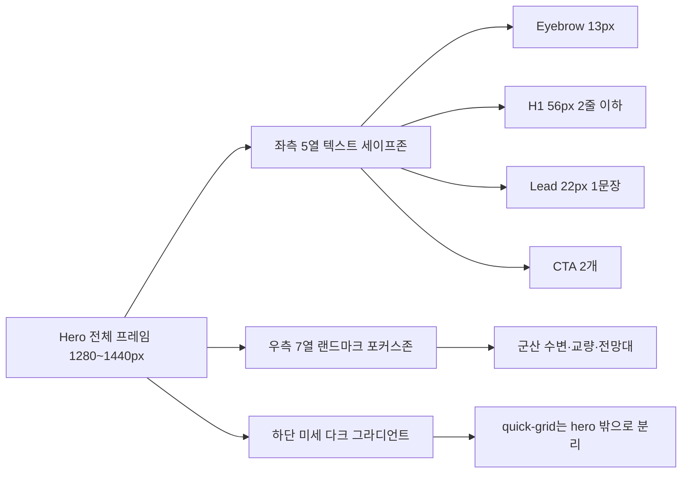
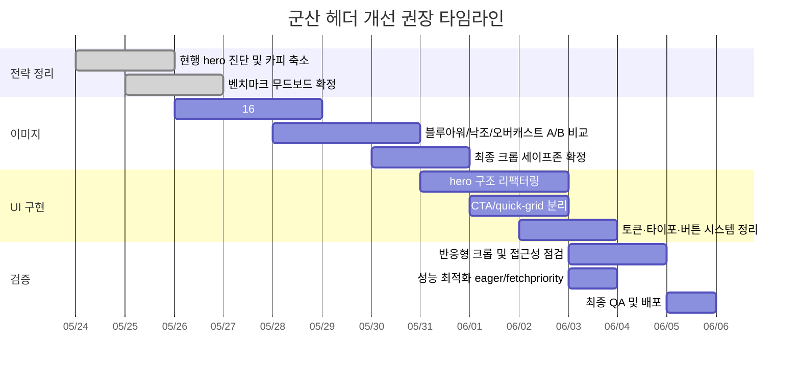

# 군산 홈페이지 헤더 프리미엄 업그레이드 리서치 보고서

## 핵심 요약

첨부된 교체 이미지 자체는 방향이 좋습니다. 기존 스크린샷의 가장 큰 약점이었던 “슬라이드 템플릿처럼 보이는 장식적 오버레이”와 과한 주황색 대각 그래픽은 실제 풍경 사진의 신뢰감으로 대체되었고, 원거리 수변 풍경·넓은 하늘·도시 인프라가 함께 보이는 구도는 상단 hero용으로 충분히 좋은 출발점입니다. 다만 글로벌 대기업 홈페이지들을 같이 보면, 프리미엄 인상은 **사진의 품질만으로 결정되지 않고** 한 장의 메인 비주얼, 짧고 날카로운 헤드라인, 제한된 CTA 수, 넉넉한 여백, 토큰화된 일관된 디자인 시스템에서 만들어집니다. Apple, Samsung, Google, Microsoft, NVIDIA, Hyundai, Toyota, Sony, Intel, Cisco의 상단 구성을 종합하면, 장식 요소는 줄이고 주제 이미지는 더 또렷하게 만들며, CTA는 1~2개로 압축하고, 타이포는 명확한 단계로 정리하는 방향이 가장 일관되게 보입니다. citeturn0view0turn11view0turn2view0turn1view0turn1view1turn1view2turn1view3turn19view2turn19view0turn19view1turn18view1turn18view2turn18view0

현재 군산 페이지의 헤더 시스템은 hero 높이 422px, 좌측으로 강하게 밝아지는 흰색 그라디언트 오버레이, 큰 `hero-pill`, 46–72px까지 커지는 제목, 22–34px 부제, 그리고 hero 아래로 `-46px` 겹쳐 올라오는 quick-grid를 사용합니다. 즉, 지금 구조는 “풍경을 주인공으로 세운 프리미엄 hero”라기보다 “정보 카드와 안내 요소를 상단에 밀집시킨 행사 소개 레이아웃”에 가깝습니다. 여기에 현재 교체 사진은 세로 비율이 비교적 큰 원본이어서, 얕은 hero 높이 안에서 반응형 크롭이 걸릴 때 사진의 공간감이 안정적으로 유지되지 않을 가능성이 있습니다. fileciteturn0file1

그래서 가장 효과적인 개선 방향은 **Apple·Microsoft·Hyundai 계열의 절제된 corporate-editorial hero**를 참조해, 군산의 장면은 더 크게, 텍스트는 더 짧게, CTA는 더 적게, 정보 카드들은 hero 아래로 분리하는 것입니다. 구현 수준에서는 hero 이미지를 above-the-fold 핵심 리소스로 다루고, `object-fit`/`object-position`으로 크롭을 제어하며, 텍스트 대비는 WCAG 기준을 맞추고, glass card를 쓸 경우에는 `backdrop-filter`와 투명 배경 원리를 명확히 지켜야 합니다. 또한 파랄랙스나 확대 애니메이션을 넣더라도 `prefers-reduced-motion` 대응은 필수입니다. citeturn5view4turn14view0turn14view1turn13view0turn15view0turn24view0turn17view0

분석 전제는 다음과 같습니다. 별도의 군산 브랜드 가이드라인, 행사 BI, 예산 제한은 제공되지 않았고, 현재 HTML 메타 설명과 섹션 구조상 이 페이지는 “소규모 단합대회 참여자를 위한 1박 2일 안내” 성격을 가진 사내/행사형 정보 페이지입니다. 따라서 본 보고서는 **고급형 행사 랜딩 + 지역 인상 강화**라는 이중 목적을 가정했습니다. Apple HIG와 Material 3 공식 문서는 우선 출처로 확인했지만, 이 감사 환경에서는 본문이 JavaScript 의존이라 상세 텍스트 추출이 제한되었고, 그래서 실제 구현 근거는 web.dev, MDN, W3C, Fluent, Carbon, Primer, Pretendard 공식 자료를 함께 사용했습니다. fileciteturn0file1 citeturn5view0turn5view1turn5view2turn5view3turn5view4turn13view0turn14view0turn14view1turn15view0turn24view0turn18view1turn18view2turn18view0turn10view0

## 글로벌 대기업 헤더 벤치마크

아래 표는 2026-05-23 기준 각 공식 홈페이지 상단의 공개 상태를 기준으로 정리한 요약입니다. 타이포 크기는 CSS 추출이 아니라 **데스크톱 1440px 전후에서 본 시각 추정치**이며, 동적 슬라이드가 있는 사이트는 당시 첫 화면에 가까운 패턴을 기준으로 읽었습니다. 공식 사이트와 디자인 시스템의 공통점은 “과한 장식 대신 주제 하나를 크게 보여준다”는 점입니다. citeturn0view0turn11view0turn2view0turn1view0turn1view1turn1view2turn1view3turn19view2turn19view0turn19view1

| 회사 | 공식 소스 URL | 컬러 팔레트 | 타이포 스타일·크기 | 이미지 처리 | 간격·그리드 | 히어로 텍스트 배치 | CTA 스타일 |
|---|---|---|---|---|---|---|---|
| Apple | `https://www.apple.com/kr/` citeturn0view0 | 흑백·중성색 중심, 제품 색만 포인트 | 시스템/브랜드 산세리프, H1 약 48–80px 추정 | 제품 컷을 매우 크게, 배경은 단순 | 여백이 매우 크고 모듈형 섹션 분절 | 중앙 또는 좌측, 문장 수 짧음 | 텍스트 링크 2개 조합이 많음 |
| Samsung | `https://www.samsung.com/sec/` citeturn11view0 | 블랙·화이트·브랜드 블루, 네온 포인트 | 굵은 산세리프, H1 약 44–64px 추정 | 다크 배경의 시네마틱 제품 렌더/영상 | 풀폭 슬라이드이지만 정보 밀도는 통제 | 좌측 또는 중앙 스택 | “더 알아보기”형 1차 CTA가 선명 |
| About Google | `https://about.google/` citeturn2view0 | 화이트 베이스, Google 4색은 제한적으로만 사용 | Google Sans 계열 인상, H1 약 48–72px 추정 | 편집형 대표 이미지 1장 + 카드형 후속 모듈 | 넓은 여백, 카드와 리스트의 리듬 | 좌측 정렬, 한 줄 메시지 중심 | 단일 텍스트 CTA가 많음 |
| Microsoft | `https://www.microsoft.com/ko-kr/` citeturn1view0 | 화이트·그레이·파랑 포인트 | Segoe/Fluent 계열 인상, H1 약 40–56px 추정 | 제품/서비스 이미지를 정제된 배경과 함께 제시 | 슬라이드 구조지만 본문 블록이 명확 | 좌측 정렬이 기본 | 채워진 버튼 1개 + 보조 링크 |
| NVIDIA | `https://www.nvidia.com/ko-kr/` citeturn1view1turn23view1turn23view2 | 차콜·블랙·NVIDIA 그린 | 매우 굵은 산세리프, H1 약 48–64px 추정 | 다크 시네마틱 비주얼, 기술/RTX/AI 하이컨트라스트 | 섹션 밀도가 높지만 대비가 강함 | 좌측 정렬 위주 | 고대비 CTA·텍스트 링크 혼합 |
| Hyundai | `https://www.hyundai.com/kr/ko/e` citeturn1view2 | 화이트·네이비·차분한 그레이 | 깔끔한 산세리프, H1/H2 약 36–52px 추정 | 자동차 사진과 서비스 모듈을 분리 | 상단 hero와 바로 가기 도구가 구조화됨 | 좌측 또는 중앙, 짧은 문장 | 유틸리티 버튼과 정보형 CTA 혼합 |
| Toyota | `https://global.toyota/en/` citeturn1view3 | 화이트·레드 포인트 | 편집형 산세리프, H1 약 32–48px 추정 | 거대한 한 장 hero보다 editorial pick 모듈 | 잡지형 카드 그리드 성격이 강함 | 카드 내부 좌측 | 링크 기반 CTA 위주 |
| Sony | `https://www.sony.com/en/` citeturn19view2 | 블랙·화이트 중심, 콘텐츠별 accent | 편집형 산세리프, H1 약 44–60px 추정 | 비디오·대형 이미지·엔터테인먼트 컷 | 숨 쉴 공간이 크고 motion cue가 많음 | 중앙/좌측 혼합, 카피는 짧음 | 미니멀 링크 CTA |
| Intel | `https://www.intel.com/content/www/us/en/homepage.html` citeturn19view0 | 인텔 블루·화이트·다크 배경 | 테크 산세리프, H1 약 40–56px 추정 | 강한 제품/캠페인 이미지와 짧은 카피 | hero 뒤에 모듈 섹션이 이어짐 | 좌측 정렬 | 단일 CTA가 명확 |
| Cisco | `https://www.cisco.com/` citeturn19view1 | 화이트·네이비·청록 계열 | 엔터프라이즈 산세리프, H1 약 44–60px 추정 | 이벤트·AI 사진을 넓게 사용 | 풀폭 hero + 아래 기술 카드 구조 | 좌측 정렬 | 채워진 1차 CTA가 또렷 |

이 10개를 한꺼번에 보면, 상단 첫 화면에서 **주요 CTA를 1~2개로 제한**하고, **헤드라인은 보통 1~2개 문장으로 압축**하며, **하나의 주제 이미지 또는 주제 모듈에 시선을 묶는 방식**이 반복됩니다. 또한 장식용 프레임·배지·겹치는 카드가 주인공이 되는 경우는 드물고, 그 대신 색상은 1개 주조색과 1개 포인트 색에 머무는 경우가 많습니다. 디자인 시스템 관점에서는 Microsoft Fluent, IBM Carbon, GitHub Primer가 모두 토큰·컴포넌트·가이드라인 기반의 일관성 있는 UI 생산을 강조하고 있습니다. citeturn0view0turn11view0turn2view0turn1view0turn1view1turn1view2turn1view3turn19view2turn19view0turn19view1turn18view1turn18view2turn18view0

## 현재 군산 헤더 진단

현재 군산 헤더는 구조적으로 이미 “안내 페이지형” 성격을 강하게 갖고 있습니다. body 전체는 Pretendard를 포함한 시스템 산세리프 스택을 사용하고, hero는 좌측 백색 그라디언트, 우측 배경 이미지, 큰 행사 pill, 대형 헤드라인, 부제, 메타 pill, 그리고 바로 아래 겹침 quick-grid로 구성됩니다. 이 구조는 정보 전달에는 유리하지만, 첫 화면을 고급스럽게 보이게 하는 데 필요한 **단일 초점과 여백의 긴장감**을 약화시킵니다. 특히 quick-grid가 hero 아래로 겹쳐 올라오는 방식은 “서비스 카드가 응집된 대시보드”처럼 읽혀, 풍경 중심의 프리미엄 인상과 충돌합니다. fileciteturn0file1


교체된 사진은 방향이 좋습니다. 넓은 하늘이 좌측 텍스트 세이프존으로 활용될 여지가 있고, 우측의 전망대와 교량, 수변 산책로, 저녁 조명이 한 장에서 깊이를 만듭니다. 문제는 이 이미지를 “프리미엄 hero 마스터”로 다시 설계하지 않고, 기존 레이아웃 틀 안에 넣으면 사진의 장점이 충분히 살아나지 않는다는 점입니다. 지금처럼 흰색 오버레이가 강하고 행사용 pill과 메타 pill이 크면 사진은 배경으로 후퇴하고, 결과적으로 “좋은 사진이 들어간 안내 배너” 수준에 머물 가능성이 큽니다. 반대로 벤치마크 수준에서는 이미지 자체가 주인공이 되고 UI는 조용히 보조해야 합니다. citeturn0view0turn1view0turn1view2turn19view2turn19view1

| 진단 항목 | 현재 군산 헤더 상태 | 벤치마크 대비 갭 | 우선순위 |
|---|---|---|---|
| 컬러·톤 | 이전 스크린샷은 주황색 템플릿 오버레이가 강했고, 현재는 자연 사진으로 개선됐지만 페이지 오버레이는 여전히 밝고 부드럽게만 처리됨 | 프리미엄 사례는 대체로 **절제된 주조색 + 하나의 포인트 색**으로 정리되고, 대비 설계가 더 명확함 | High |
| 타이포그래피 | 행사 pill, 큰 H1, 부제, 메타 pill이 모두 크고 존재감이 큼 | 대기업 hero는 텍스트 단계가 더 선명하고, badge는 작거나 아예 없음 | High |
| 구성·레이아웃 | quick-grid가 hero를 침범해 첫 화면 밀도가 높음 | 프리미엄 사례는 hero와 utility layer를 분리해 첫 인상을 정돈함 | High |
| 이미지 처리 | 사진은 좋지만 hero 전용 16:5 또는 21:7 마스터로 최적화되지 않음 | 벤치마크는 크롭 세이프존이 분명하고 focal point가 더 명확함 | High |
| 거리감·랜드스케이프 | 원경과 수변이 잘 보이지만 “군산을 즉시 떠올리는 대표성”은 조금 더 강화 가능 | 최고 수준 hero는 도시/제품/브랜드 정체성이 **한눈에 식별**되게 설계됨 | Medium |
| 시각적 계층 | 행사 정보와 지역 인상이 경쟁함 | 상위 사례는 한 화면에서 한 메시지에 우선권을 부여함 | High |
| 브랜딩 단서 | 카피가 다소 범용적이고, 군산만의 어휘가 약함 | 프리미엄 hero는 헤드라인만 읽어도 브랜드/장소의 성격이 남음 | High |
| 인지 품질 | 사진만 보면 훨씬 좋아졌지만, 전체 시스템은 여전히 brochure/event 느낌이 남음 | 고급감은 사진 + 타입 + 여백 + CTA 절제의 결과물 | High |

정리하면, 가장 큰 갭은 **사진이 아니라 레이아웃 시스템**에 있습니다. 이미지는 “쓸 만한 수준”에 도달했지만, 프리미엄 인상으로 끌어올리려면 hero의 정보 밀도를 낮추고, quick-grid를 분리하며, 카피를 다듬고, 군산 장면을 위한 전용 크롭과 색보정을 다시 설계해야 합니다. 이 판단 기준은 현재 HTML 구조와 위 10개 벤치마크의 공통 패턴을 비교한 결과입니다. fileciteturn0file1 citeturn0view0turn11view0turn2view0turn1view0turn1view1turn1view2turn1view3turn19view2turn19view0turn19view1

## 프리미엄 디자인 권고안

가장 맞는 방향은 “관광 브로셔”보다 “기업형 에디토리얼 랜딩”입니다. 즉, 군산을 소개하되 행사 정보를 다 쏟아붓지 말고, 첫 화면에서는 **도시 인상 하나를 크게 각인**시키고, 행동은 CTA 두 개만 남겨야 합니다. 적용 기준은 Apple의 절제된 모듈 방식, Microsoft의 깨끗한 정보 블록, Hyundai의 서비스 명확성, Sony의 대형 콘텐츠 호흡, Cisco의 엔터프라이즈형 메시지 집중을 중간 지점에서 합친 형태가 적합합니다. citeturn0view0turn1view0turn1view2turn19view2turn19view1

| 요소 | 권장안 |
|---|---|
| 컬러 팔레트 | **기본안 Blue Hour Premium**: `#081A2D`(deep navy), `#10304F`(harbor blue), `#557596`(mist steel), `#DCE7F0`(light fog), `#F7FAFD`(off white), `#D2A66A`(warm brass accent). **보조안 Dawn Mist**: `#0F2238`, `#2A4868`, `#708CA7`, `#EEF4F8`, `#FFFFFF`, `#9FB8CC`. **따뜻한 대체안 Harbor Sunset Restraint**: `#102033`, `#26435F`, `#8C9FB2`, `#F4F1EC`, `#FFFFFF`, `#C79059`. |
| 폰트 | 웹은 `Pretendard Variable`, fallback으로 `Pretendard`, `Apple SD Gothic Neo`, `Noto Sans KR`, 시스템 sans-serif. Pretendard는 크로스플랫폼에서 자연스럽고 현대적인 가독성을 목표로 하며 9가지 굵기와 가변 폰트를 지원합니다. citeturn10view0 |
| 제목 체계 | **H1**: desktop `56px/1.05/800`, tablet `44px/1.08/800`, mobile `34px/1.12/780`, `letter-spacing: -0.04em`. **H2**: desktop `28px/1.2/700`, tablet `24px/1.25/700`, mobile `20px/1.3/700`. **Body**: desktop `16px/1.7/400`, mobile `15px/1.65/400`. **Eyebrow**: `13px/1.2/600`, uppercase 대신 한국어 짧은 라벨 사용. |
| 카피 구조 | 이벤트 pill을 큰 배지로 두지 말고, 작은 eyebrow 1개만 사용. 예: `군산 단합대회 1박 2일`. H1은 2줄 이하. 추천: `서해와 도시가 만나는 군산`. 서브카피는 한 문장만: `넓은 수변 풍경과 여유로운 동선으로 시작하는 1박 2일 일정 안내`. |
| 간격·여백 | hero `max-width: 1280px`, 좌우 여백 desktop `80px`, tablet `40px`, mobile `20px`. 텍스트 컬럼 폭 `520~560px`. hero top padding `112px`, bottom padding `88px`. quick-grid는 hero 아래 `24~32px` 간격으로 완전히 분리. |
| 레이아웃 | 12-column grid. 텍스트는 좌측 5열, 풍경 focal point는 우측 7열. H1과 CTA 블록 사이 20px, CTA 간 12px. 메타 pill은 hero에서 제거하고 hero 아래 서브 정보 섹션으로 이동. |
| 이미지 처리 | hero 전용 마스터 이미지를 **`2560×800` 또는 `2880×900`**으로 새로 생성하는 것을 권장. 색보정은 `saturation -8%`, `contrast +3%`, `clarity +4%`, `highlights -12%`, `shadow +4%`. 하늘과 물의 차가운 블루를 유지하되, 조명은 과도하게 노랗게 밀지 않기. |
| 오버레이 | 이미지 위에는 **두 겹 그라디언트**를 권장: 좌측 짙은 navy 투명막 + 하단 아주 얕은 dark gradient. 이렇게 해야 텍스트 대비를 안정적으로 확보하면서 도시 장면을 살릴 수 있습니다. 텍스트는 일반 본문 기준 최소 4.5:1, 큰 제목은 최소 3:1, 의미 있는 버튼/포커스/경계는 3:1 이상을 맞추는 것이 안전합니다. citeturn15view0turn24view0 |
| 카드 스타일 | **데스크톱 기본안은 무카드**입니다. 텍스트를 직접 올리고, 이미지가 지나치게 복잡한 경우에만 유리 반투명 패널을 보조적으로 사용합니다. glass card를 쓸 경우 `rgba(255,255,255,.08~.14)` + `backdrop-filter: blur(16px) saturate(140%)` + `1px solid rgba(255,255,255,.18)` + `border-radius: 24px`. `backdrop-filter`는 투명 또는 반투명 배경에서만 효과가 보이며, 최신 브라우저에서 광범위해졌지만 구형 환경은 폴백을 두는 편이 좋습니다. citeturn13view0 |
| 버튼·CTA | 1차 CTA는 채워진 버튼 1개, 2차는 ghost/outline 1개. 버튼 높이 `52px`, radius `999px`, padding `0 22px`, font `16px/600`. Primary: 배경 `#F7FAFD`, 텍스트 `#081A2D`. Secondary: 배경 `rgba(255,255,255,.08)`, 테두리 `rgba(255,255,255,.20)`, 텍스트 `#F7FAFD`. |
| 마이크로 인터랙션 | hover 시 button `translateY(-1px)` + shadow 강화, hero image는 load 때 `scale(1.02→1.00)` 정도만. parallax는 마우스 움직임 기준 `6~10px` 이내로 제한. 애니메이션은 220–360ms 범위, `ease-out`. `prefers-reduced-motion`가 켜져 있으면 parallax와 zoom을 끄고 opacity 전환만 유지. citeturn17view0 |
| 반응형 규칙 | desktop hero 높이 `min-height: clamp(560px, 68svh, 760px)`. tablet `520px`, mobile `420~460px`. mobile에서는 overlay를 조금 더 강하게 하고, `object-position`을 오른쪽 랜드마크 중심으로 미세 조정. quick-grid는 1열로, hero와 분리. 이미지 크롭은 `object-fit: cover`, 초점은 `object-position`으로 제어. above-the-fold hero 이미지에는 `width/height`, `loading="eager"`, `fetchpriority="high"`를 준다. citeturn5view4turn14view0turn14view1 |

기술 구현은 이미지 크롭과 우선순위 로딩을 더 정교하게 다루기 위해 CSS `background-image`보다 `<picture>` 구조가 유리합니다. web.dev는 반응형 이미지에서 `width`·`height` 힌트, `object-fit`, `object-position`, hero 이미지의 `loading="eager"`와 `fetchpriority="high"`를 중요한 포인트로 설명하고 있고, MDN 역시 `object-fit`과 `object-position`이 컨테이너 내 크롭과 정렬을 담당한다고 명시합니다. 따라서 지금처럼 hero 핵심 이미지를 CSS 배경으로만 두는 방식보다, 이미지 자체를 콘텐츠 레이어로 올리는 편이 프리미엄 품질과 성능 관리 모두에서 낫습니다. citeturn5view4turn14view0turn14view1



## 실행용 프롬프트와 구현 사양

아래 다섯 개 프롬프트는 **같은 디자인 방향**을 공유하되, 시간대와 분위기만 달리해 비교 생성할 수 있게 만든 것입니다. 공통 원칙은 다음과 같습니다. 첫째, **원경/롱샷**이어야 합니다. 둘째, **좌측 35~40%는 텍스트 세이프존**으로 비워 둡니다. 셋째, **텍스트·로고·사람·드론 UI·가짜 간판**은 넣지 않습니다. 넷째, 결과 비율은 hero용으로 `16:5`, `1920x600`, `2560x800`, `2880x900` 중 하나를 명시합니다.

**프롬프트 A**

```text
군산의 프리미엄 웹사이트 hero 이미지, wide long-distance waterfront cityscape, blue hour, calm premium mood, expansive sky on the left for headline safe space, iconic bridge and modern waterfront observation facility on the right, reflective water, subtle path lights, realistic Korean west-coast atmosphere, restrained cinematic color grading, cool navy and steel-blue palette, natural contrast, editorial tourism photography, ultra-clean composition, no clutter, no heavy HDR, no over-saturation, high realism, 16:5 aspect ratio, 2560x800

Negative prompt: text, logo, watermark, people, crowd, vehicles in foreground, fake skyline, exaggerated orange sunset, lens flare, oversharpening, poster look, brochure graphics, collage elements
```

**프롬프트 B**

```text
군산 원경 hero scene, early dawn mist over calm water, long-distance panoramic composition, left side mostly open sky and soft horizon for UI text placement, right side with bridge silhouette and waterfront architecture, minimal luxurious mood, soft fog layers, premium corporate editorial photography, elegant subdued blue-gray color grading, realistic light, no tourism poster styling, 1920x600

Negative prompt: text, logo, people, boats close-up, cluttered foreground, dramatic fake sunlight, overprocessed sky, cartoon rendering, infographic layout
```

**프롬프트 C**

```text
군산 수변 도시 파노라마, golden hour but restrained, wide aerial feeling without extreme top-down angle, horizon placed low for spacious sky, bridge and shoreline on the right third, warm highlights only on architecture and path lights, premium global corporate homepage hero style, realistic, elegant, controlled saturation, long-distance landscape photography, 16:5, 2880x900

Negative prompt: text overlays, logos, people, festival banners, heavy orange cast, social media thumbnail look, excessive vignette, hyper-HDR
```

**프롬프트 D**

```text
Gunsan premium homepage hero image, cool overcast afternoon, sophisticated neutral tone, wide long shot, strong compositional balance, left text-safe negative space with water and sky, right focal landmark with bridge and observation building, polished but natural realism, muted navy palette, high-end editorial architecture and landscape photography, 2560x800

Negative prompt: people, signage, text, logo, extreme saturation, artificial reflections, fantasy building, excessive blur, dramatic storm
```

**프롬프트 E**

```text
군산 블루아워 야경 hero banner, long-distance calm waterfront, soft city lights and bridge lights reflecting on water, clear hierarchy with empty left sky and water surface for typography, right-side architectural focal point, premium corporate hero, subtle cinematic depth, elegant navy-to-silver color grading, highly realistic, no poster graphics, 1920x600

Negative prompt: text, logo, watermark, people, fireworks, busy neon signs, strong magenta cast, fake bokeh, high-noise night image
```

프론트엔드/디자이너용 프롬프트는 지금 페이지의 정보를 유지하되, hero만 기업형으로 재구성하는 데 초점을 맞추는 것이 좋습니다. 핵심은 “배지·메타 pill·quick-grid를 첫 화면에서 줄이고, hero를 one-message layout으로 전환하라”는 것입니다. 이 방향은 상위 기업 hero의 공통 패턴과 디자인 시스템 토큰 접근, 그리고 web.dev·MDN·W3C의 구현 가이드를 함께 반영한 것입니다. citeturn18view1turn18view2turn18view0turn5view4turn13view0turn14view0turn14view1turn15view0turn24view0

```text
군산 단합대회 안내페이지의 hero 영역을 Apple/Microsoft/Hyundai 스타일의 premium corporate editorial hero로 리디자인하라. 
조건:
- 첫 화면은 군산 원경 풍경이 주인공이어야 한다.
- 행사 badge는 큰 pill이 아니라 small eyebrow로 축소한다.
- H1은 2줄 이하, 서브카피는 1문장만 사용한다.
- CTA는 2개만 남긴다: primary 1개, secondary 1개.
- quick-grid는 hero와 겹치지 않게 hero 아래로 완전 분리한다.
- 색은 navy/steel-blue/white를 기본으로 하고 warm brass는 아주 약한 accent만 허용한다.
- 과한 shadow, 과한 glass, 과한 gradient를 피하고, contrast와 spacing으로 고급감을 만든다.
- mobile에서는 overlay를 강화하고 object-position을 조정해 우측 랜드마크가 남도록 한다.
- prefers-reduced-motion 대응을 포함한다.
```

```html
<header class="hero">
  <picture class="hero-media" aria-hidden="true">
    <source
      media="(max-width: 767px)"
      srcset="/images/gunsan-hero-mobile-1280x1600.webp" />
    
  </picture>

  <div class="hero-overlay"></div>

  <div class="hero-shell">
    <div class="hero-content">
      <p class="hero-eyebrow">군산 단합대회 1박 2일</p>
      <h1 class="hero-title">서해와 도시가 만나는 군산</h1>
      <p class="hero-lead">넓은 수변 풍경과 여유로운 동선으로 시작하는 일정 안내</p>

      <div class="hero-actions">
        <a href="#schedule" class="btn btn-primary">일정 보기</a>
        <a href="#transport" class="btn btn-secondary">이동·경비 확인</a>
      </div>
    </div>
  </div>
</header>
```

```css
:root {
  --hero-image: url("/images/gunsan-hero-2560x800.webp");

  --ink-strong: #f7fafd;
  --ink-muted: #dbe6f0;
  --bg-deep: #081a2d;
  --bg-mid: #10304f;
  --bg-soft: #557596;
  --accent: #d2a66a;

  --surface-glass: rgba(255, 255, 255, 0.10);
  --surface-glass-border: rgba(255, 255, 255, 0.18);

  --shadow-hero: 0 24px 64px rgba(6, 18, 34, 0.18);
  --shadow-btn: 0 10px 28px rgba(6, 18, 34, 0.18);

  --radius-pill: 999px;
  --radius-card: 24px;

  --space-1: 8px;
  --space-2: 12px;
  --space-3: 16px;
  --space-4: 20px;
  --space-5: 24px;
  --space-6: 32px;
  --space-7: 48px;
  --space-8: 64px;
  --space-9: 80px;

  --container-max: 1280px;
  --text-max: 560px;
}

.hero {
  position: relative;
  isolation: isolate;
  min-height: clamp(560px, 68svh, 760px);
  overflow: clip;
  background: var(--bg-deep);
}

.hero-media,
.hero-media img,
.hero-overlay,
.hero-shell {
  position: absolute;
  inset: 0;
}

.hero-media img {
  width: 100%;
  height: 100%;
  object-fit: cover;
  object-position: 72% 52%;
  filter: saturate(.94) contrast(1.03) brightness(.92);
  transform: scale(1.01);
}

.hero-overlay {
  background-image:
    linear-gradient(
      90deg,
      rgba(8, 26, 45, .78) 0%,
      rgba(8, 26, 45, .56) 34%,
      rgba(8, 26, 45, .18) 58%,
      rgba(8, 26, 45, .06) 100%
    ),
    linear-gradient(
      180deg,
      rgba(4, 11, 19, .10) 0%,
      rgba(4, 11, 19, .28) 100%
    );
  z-index: 1;
}

.hero-shell {
  z-index: 2;
  position: relative;
  display: grid;
  grid-template-columns: repeat(12, minmax(0, 1fr));
  width: min(calc(100% - 160px), var(--container-max));
  margin: 0 auto;
  padding-block: 112px 88px;
}

.hero-content {
  grid-column: 1 / span 5;
  max-width: var(--text-max);
  align-self: center;
}

.hero-eyebrow {
  margin: 0 0 16px;
  color: var(--ink-muted);
  font-family: "Pretendard Variable","Pretendard","Apple SD Gothic Neo","Noto Sans KR",-apple-system,BlinkMacSystemFont,"Segoe UI",sans-serif;
  font-size: 13px;
  line-height: 1.2;
  font-weight: 600;
  letter-spacing: -0.01em;
  opacity: .92;
}

.hero-title {
  margin: 0;
  color: var(--ink-strong);
  font-family: "Pretendard Variable","Pretendard","Apple SD Gothic Neo","Noto Sans KR",-apple-system,BlinkMacSystemFont,"Segoe UI",sans-serif;
  font-size: 56px;
  line-height: 1.05;
  font-weight: 800;
  letter-spacing: -0.04em;
  text-wrap: balance;
  max-width: 11ch;
  text-shadow: 0 1px 2px rgba(5, 15, 28, .18);
}

.hero-lead {
  margin: 18px 0 0;
  max-width: 34ch;
  color: var(--ink-muted);
  font-size: 22px;
  line-height: 1.45;
  font-weight: 500;
  letter-spacing: -0.02em;
}

.hero-actions {
  display: flex;
  flex-wrap: wrap;
  gap: 12px;
  margin-top: 28px;
}

.btn {
  display: inline-flex;
  align-items: center;
  justify-content: center;
  min-width: 140px;
  height: 52px;
  padding-inline: 22px;
  border-radius: var(--radius-pill);
  font-size: 16px;
  line-height: 1;
  font-weight: 600;
  letter-spacing: -0.01em;
  text-decoration: none;
  transition: transform .24s ease-out, box-shadow .24s ease-out, background-color .24s ease-out, border-color .24s ease-out, color .24s ease-out;
}

.btn-primary {
  color: var(--bg-deep);
  background: #f7fafd;
  box-shadow: var(--shadow-btn);
}

.btn-secondary {
  color: var(--ink-strong);
  background: rgba(255,255,255,.08);
  border: 1px solid rgba(255,255,255,.20);
  backdrop-filter: blur(16px) saturate(140%);
}

.btn:hover {
  transform: translateY(-1px);
}

.btn:focus-visible {
  outline: 3px solid #ffffff;
  outline-offset: 3px;
}

.quick-grid {
  width: min(calc(100% - 160px), var(--container-max));
  margin: 24px auto 0; /* 기존 음수 마진 제거 */
}

@media (max-width: 1024px) {
  .hero {
    min-height: 520px;
  }

  .hero-shell {
    width: min(calc(100% - 80px), var(--container-max));
    padding-block: 88px 72px;
  }

  .hero-content {
    grid-column: 1 / span 7;
  }

  .hero-title {
    font-size: 44px;
    line-height: 1.08;
  }

  .hero-lead {
    font-size: 20px;
  }

  .hero-media img {
    object-position: 74% 52%;
  }

  .quick-grid {
    width: min(calc(100% - 80px), var(--container-max));
  }
}

@media (max-width: 767px) {
  .hero {
    min-height: 440px;
  }

  .hero-shell {
    width: min(calc(100% - 40px), var(--container-max));
    grid-template-columns: 1fr;
    padding-block: 64px 48px;
  }

  .hero-content {
    grid-column: 1;
    max-width: none;
  }

  .hero-overlay {
    background-image:
      linear-gradient(
        180deg,
        rgba(8, 26, 45, .74) 0%,
        rgba(8, 26, 45, .54) 42%,
        rgba(8, 26, 45, .40) 100%
      );
  }

  .hero-media img {
    object-position: 76% 50%;
  }

  .hero-title {
    font-size: 34px;
    line-height: 1.12;
    max-width: 12ch;
  }

  .hero-lead {
    font-size: 17px;
    line-height: 1.55;
    max-width: 28ch;
  }

  .hero-actions {
    flex-direction: column;
  }

  .btn {
    width: 100%;
  }

  .quick-grid {
    width: min(calc(100% - 32px), var(--container-max));
    margin-top: 20px;
  }
}

@media (prefers-reduced-motion: reduce) {
  .hero-media img,
  .btn {
    transition: none;
    transform: none;
  }
}
```

## 대체 콘셉트와 도입 로드맵

현재의 교체 이미지를 더 다듬는 방식도 좋지만, 군산의 인상을 더 또렷하게 만들려면 hero 후보를 몇 가지 병렬로 실험하는 것이 좋습니다. 핵심은 “군산을 한눈에 읽게 하면서도 텍스트를 얹기 쉬운 원경”입니다. 아래 다섯 콘셉트는 모두 **롱샷·텍스트 세이프존·웹 hero 비율**을 전제로 설계했습니다.

| 콘셉트 | 짧은 설명 | 이미지 생성 프롬프트 |
|---|---|---|
| 블루아워 수변 파노라마 | 현재 교체 이미지와 가장 가깝고, 고급감이 안정적 | `군산 블루아워 수변 파노라마, long-distance waterfront cityscape, large empty sky and water on left, bridge and observatory on right, premium corporate homepage hero, cool cinematic navy palette, realistic reflections, 16:5, 2560x800, no text no logo no people no poster graphics` |
| 선유도 낙조 실루엣 | 군산의 섬 정체성을 더 강하게 보이게 하는 감성형 대안 | `군산 선유도 원경 hero image, long-distance island silhouette at sunset, elegant restrained golden-blue grading, wide open sky for text-safe composition, white sand and layered islands in distance, premium editorial landscape photography, 1920x600, no people no text no logo no oversaturated orange` |
| 새만금 선형 스케일 | 도시보다 인프라 스케일과 미래성을 강조 | `군산 새만금 방조제 원경 hero, ultra-wide long-distance view, strong linear perspective across sea, minimal premium mood, cool steel-blue palette, expansive left-side negative space, modern Korean coastal infrastructure, realistic, 16:5, 2880x900, no people no text no infographic look` |
| 내항 근대 워터프런트 | 군산의 역사성과 수변 도시성을 동시에 강조 | `군산 내항과 근대 워터프런트 원경, wide city waterfront panorama, refined historic-modern balance, calm evening light, left-side water and sky safe zone, right-side architecture focal cluster, premium corporate tourism hero, highly realistic, 2560x800, no people no text no logos` |
| 비응도 풍차·해양 경관 | 해양도시·서해 바람·청정한 수평감 강조 | `군산 비응도 해양 원경 hero, long-distance coastal panorama with wind turbines in far background, premium minimal mood, cool air and subtle evening light, wide left sky reserved for headline, realistic Korean west coast, 1920x600, no people no text no excessive atmosphere no travel brochure layout` |

도입은 한 번에 모든 걸 바꾸기보다, **이미지 마스터 → hero 카피/CTA → 구조 분리 → 성능·접근성 보정** 순으로 가야 품질이 가장 안정적입니다. 특히 hero는 위쪽 첫 로드 구간이므로 이미지 로딩 우선순위, 크롭 제어, 대비, 모션 줄이기까지 한 번에 검증해야 합니다. web.dev, MDN, W3C, 그리고 주요 디자인 시스템이 모두 결국 같은 방향을 말합니다. 즉, 보여줄 것은 크게 보여주고, 구조는 단순하게 만들고, 접근성과 반응형을 토큰 수준에서 관리하라는 것입니다. citeturn5view4turn13view0turn14view0turn14view1turn15view0turn24view0turn17view0turn18view1turn18view2turn18view0

