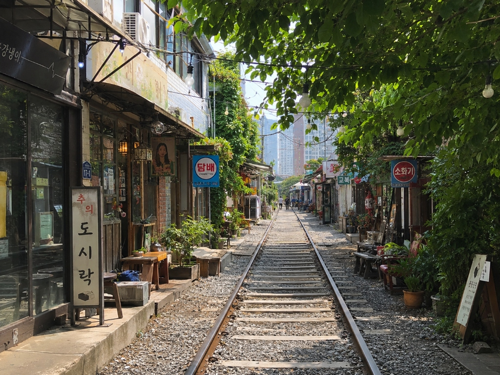
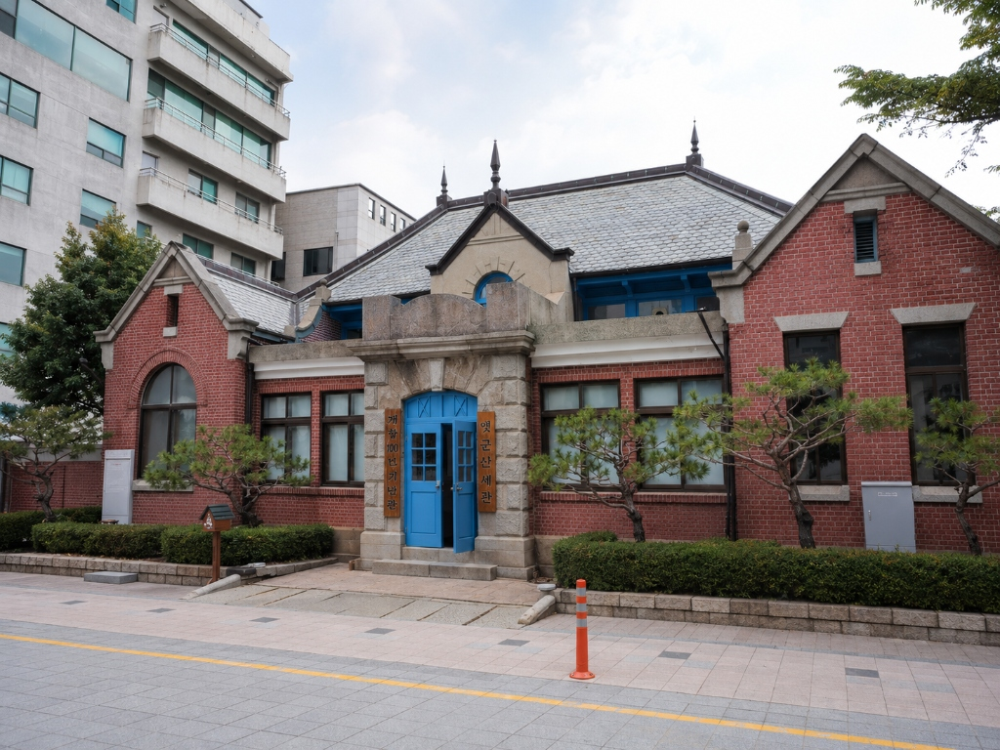
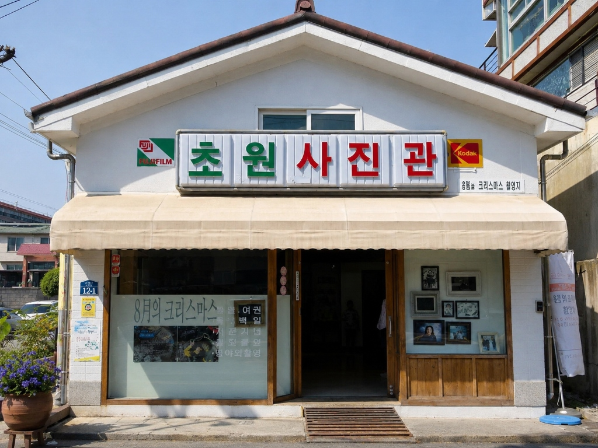
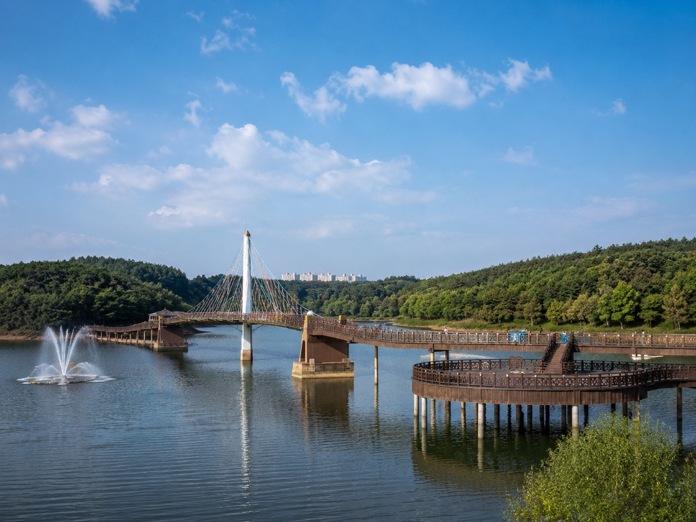

# Antigravity 입력 프롬프트 — 군산 추천 관광지 섹션 개선 최종본

현재 `index.html`의 `#tour` 섹션, 즉 “군산 추천 관광지” 영역을 더 쉽고 고급스럽게 개선해줘.

## 1. 작업 목표

현재 관광지 안내는 관광지 5개를 카드로 나열하는 구조인데, 사용자가 자유활동 시간에 “어디를 가야 할지” 바로 판단하기 어렵다.

따라서 관광지를 단순 목록이 아니라 아래 구조로 재구성한다.

1. 상단에 “상황별 추천 코스” 3개를 먼저 보여준다.
2. 그 아래에 관광지 5개를 “사진 카드” 형태로 보여준다.
3. 각 관광지는 긴 설명보다 “어떤 조에게 추천되는지”가 바로 보이게 한다.
4. 사진 파일이 있으면 실제 사진을 보여주고, 사진이 없으면 깨진 이미지 대신 고급스러운 placeholder를 보여준다.
5. 실제 이동시간, 거리, 운영시간은 확실하지 않으면 절대 임의로 작성하지 않는다.
6. 모든 관광지는 실제 방문 확정지가 아니라 “자유활동 참고용 추천 장소”로 표현한다.
7. 기존 페이지의 navy / blue / teal 계열 색감과 Apple / Hyundai 스타일의 차분하고 정돈된 분위기를 유지한다.

---

## 2. 현재 섹션 처리 방식

현재 `#tour` 섹션 전체를 아래 구조로 교체하거나, 기존 마크업을 최대한 활용해 동일한 결과가 나오도록 수정한다.

기존 상단 네비게이션이나 히어로 버튼에서 `href="#tour"`로 이동하는 구조는 유지한다.

---

## 3. 섹션 제목과 설명

섹션 제목은 그대로 유지한다.

```text
군산 추천 관광지
```

섹션 설명 문구는 아래로 변경한다.

```text
자유활동 시간에 조별 성향에 맞춰 참고할 수 있는 군산 대표 장소입니다.
```

섹션 하단에는 아래 안내 문구를 작게 넣는다.

```text
※ 위 장소는 자유활동 참고용 추천 장소입니다. 실제 방문 여부와 이동 경로는 조별 일정과 지도 앱을 기준으로 확인해 주세요.
```

---

## 4. 상단 “상황별 추천 코스” 3개 추가

관광지 사진 카드 목록 위에 “상황별 추천 코스” 카드 3개를 추가한다.

### 디자인 조건

- 데스크톱: 3열 카드
- 태블릿/모바일: 1열
- 카드 안에는 코스 번호, 코스명, 한 줄 설명, 추천 장소 목록, 태그를 넣는다.
- 과한 색상이나 큰 아이콘은 쓰지 않는다.
- 카드 배경은 white 또는 rgba(255,255,255,.9)
- border-radius는 22~24px
- border는 `#d8e6f7`
- shadow는 부드럽게 `0 14px 30px rgba(18,54,105,.08)` 정도
- 기존 페이지의 navy / blue / teal 색감과 어울리게 만든다.

---

### 코스 1

코스명:

```text
가볍게 사진 코스
```

설명:

```text
짧은 시간에 군산 분위기를 느끼고 사진을 남기기 좋은 코스입니다.
```

추천 장소:

```text
경암동 철길마을
초원사진관
근대문화거리
```

태그:

```text
사진 촬영
짧은 방문
가벼운 산책
```

---

### 코스 2

코스명:

```text
실내·역사 코스
```

설명:

```text
날씨 영향을 덜 받고 군산의 근대문화 분위기를 보기 좋은 코스입니다.
```

추천 장소:

```text
군산근대역사박물관
근대문화거리
초원사진관
```

태그:

```text
실내 가능
역사문화
차분한 일정
```

---

### 코스 3

코스명:

```text
바다·산책 코스
```

설명:

```text
군산의 바다와 호수 풍경을 여유롭게 보고 싶은 조에게 적합한 코스입니다.
```

추천 장소:

```text
은파호수공원
선유도·고군산군도
동백대교·금강하구 일대
```

태그:

```text
바다 풍경
산책
드라이브
```

---

## 5. 관광지 5개를 사진 카드 형태로 개선

기존 5개 관광지 카드를 아래 구조로 바꾼다.

### 카드 공통 구조

각 관광지 카드는 다음 순서로 구성한다.

1. 사진 영역
2. 장소명
3. 한 줄 설명
4. 추천 유형 태그
5. “이런 조에게 추천” 박스
6. 지도 보기 버튼

### 공통 디자인

- 카드는 `tour-photo-card` 클래스를 사용한다.
- 사진 영역은 카드 상단에 배치한다.
- 사진 비율은 `16:10` 또는 `4:3` 중 하나로 통일한다.
- 사진에는 `object-fit: cover`를 적용한다.
- 카드 배경은 `rgba(255,255,255,.92)`
- border는 `1px solid #d8e6f7`
- border-radius는 `24px`
- shadow는 `0 14px 30px rgba(18,54,105,.08)`
- hover 시 `translateY(-2px)`와 shadow 강화 정도만 적용한다.
- `prefers-reduced-motion: reduce` 환경에서는 hover transform을 제거한다.
- 버튼 문구는 모두 `지도 보기`로 통일한다.
- 지도 링크는 모두 새 창으로 열리게 한다.
- 모든 외부 링크에는 `target="_blank"`와 `rel="noopener noreferrer"`를 적용한다.

---

## 6. 관광지 사진 처리 방식

사진 파일을 넣을 수 있도록 `assets/tour/` 폴더 기준으로 이미지 구조를 만든다.

### 이미지 파일명

아래 파일명이 존재하면 해당 이미지를 사용한다.

```text
assets/tour/gyeongam-railway.jpg
assets/tour/modern-history-museum.jpg
assets/tour/chowon-photo-studio.jpg
assets/tour/eunpa-lake-park.jpg
assets/tour/seonyudo-island.jpg
```

### 이미지가 없을 경우

이미지 파일이 없으면 깨진 이미지 아이콘이 나오지 않게 한다.

사진이 없는 카드는 아래 형태의 placeholder를 보여준다.

```text
사진 준비 중
장소명
지도에서 위치 확인
```

### 주의사항

- 외부 이미지를 임의로 가져오지 않는다.
- 저작권이 불분명한 이미지를 사용하지 않는다.
- 가짜 이미지 URL을 만들지 않는다.
- 이미지가 없는 경우에도 디자인이 완성된 것처럼 보이도록 고급스러운 그라데이션 placeholder를 사용한다.

---

## 7. 이미지 alt 문구

각 이미지에는 아래 alt를 넣는다.

```text
경암동 철길마을 풍경
군산근대역사박물관과 근대문화거리
초원사진관 외관
은파호수공원 산책로와 호수
선유도와 고군산군도 바다 풍경
```

---

## 8. 관광지 카드별 내용

### 1. 경암동 철길마을

장소명:

```text
경암동 철길마을
```

한 줄 설명:

```text
레트로 골목 분위기와 사진 촬영을 즐기기 좋은 장소입니다.
```

추천 유형 태그:

```text
사진
짧은 방문
산책
```

이런 조에게 추천:

```text
오래 걷기보다 가볍게 둘러보고 사진을 남기고 싶은 조
```

지도 링크:

```text
https://map.kakao.com/?q=군산%20경암동%20철길마을
```

이미지 경로:

```text
assets/tour/gyeongam-railway.jpg
```

---

### 2. 군산근대역사박물관 · 근대문화거리

장소명:

```text
군산근대역사박물관 · 근대문화거리
```

한 줄 설명:

```text
군산의 근대문화도시 이미지를 가장 잘 느낄 수 있는 대표 권역입니다.
```

추천 유형 태그:

```text
역사문화
실내 가능
단체 이동
```

이런 조에게 추천:

```text
날씨 영향을 덜 받고 차분하게 둘러보고 싶은 조
```

지도 링크:

```text
https://map.kakao.com/?q=군산근대역사박물관
```

이미지 경로:

```text
assets/tour/modern-history-museum.jpg
```

---

### 3. 초원사진관

장소명:

```text
초원사진관
```

한 줄 설명:

```text
군산의 대표 포토 스팟으로 짧게 방문하기 좋은 장소입니다.
```

추천 유형 태그:

```text
사진
짧은 방문
근대문화거리 연계
```

이런 조에게 추천:

```text
짧은 시간 안에 군산다운 사진을 남기고 싶은 조
```

지도 링크:

```text
https://map.kakao.com/?q=군산%20초원사진관
```

이미지 경로:

```text
assets/tour/chowon-photo-studio.jpg
```

---

### 4. 은파호수공원

장소명:

```text
은파호수공원
```

한 줄 설명:

```text
호수와 산책로가 어우러진 여유로운 휴식형 장소입니다.
```

추천 유형 태그:

```text
산책
휴식
야경
```

이런 조에게 추천:

```text
복잡한 관광보다 조용히 걷고 쉬고 싶은 조
```

지도 링크:

```text
https://map.kakao.com/?q=군산%20은파호수공원
```

이미지 경로:

```text
assets/tour/eunpa-lake-park.jpg
```

---

### 5. 선유도 · 고군산군도

장소명:

```text
선유도 · 고군산군도
```

한 줄 설명:

```text
군산의 바다와 섬 풍경을 대표하는 드라이브형 관광지입니다.
```

추천 유형 태그:

```text
바다
드라이브
낙조
```

이런 조에게 추천:

```text
시간 여유가 있고 군산의 바다 풍경을 보고 싶은 조
```

지도 링크:

```text
https://map.kakao.com/?q=군산%20선유도
```

이미지 경로:

```text
assets/tour/seonyudo-island.jpg
```

---

## 9. 추천 HTML 구조 예시

아래 구조를 참고해 `#tour` 섹션을 개선한다.  
단, 기존 페이지의 클래스명과 스타일 구조에 맞게 필요한 경우 클래스명은 조정해도 된다.

```html
<section id="tour" class="container tour-section" style="margin-top: 60px; margin-bottom: 40px;">
  <div class="section-header-title">
    <svg class="icon section-title-icon"><use href="#i-road"/></svg>
    <h2>군산 추천 관광지</h2>
  </div>

  <p class="section-desc">
    자유활동 시간에 조별 성향에 맞춰 참고할 수 있는 군산 대표 장소입니다.
  </p>

  <div class="tour-course-grid" aria-label="상황별 추천 코스">
    <article class="tour-course-card">
      <span class="course-label">COURSE 01</span>
      <h3>가볍게 사진 코스</h3>
      <p>짧은 시간에 군산 분위기를 느끼고 사진을 남기기 좋은 코스입니다.</p>
      <ul>
        <li>경암동 철길마을</li>
        <li>초원사진관</li>
        <li>근대문화거리</li>
      </ul>
      <div class="tour-tags">
        <span>사진 촬영</span>
        <span>짧은 방문</span>
        <span>가벼운 산책</span>
      </div>
    </article>

    <article class="tour-course-card">
      <span class="course-label">COURSE 02</span>
      <h3>실내·역사 코스</h3>
      <p>날씨 영향을 덜 받고 군산의 근대문화 분위기를 보기 좋은 코스입니다.</p>
      <ul>
        <li>군산근대역사박물관</li>
        <li>근대문화거리</li>
        <li>초원사진관</li>
      </ul>
      <div class="tour-tags">
        <span>실내 가능</span>
        <span>역사문화</span>
        <span>차분한 일정</span>
      </div>
    </article>

    <article class="tour-course-card">
      <span class="course-label">COURSE 03</span>
      <h3>바다·산책 코스</h3>
      <p>군산의 바다와 호수 풍경을 여유롭게 보고 싶은 조에게 적합한 코스입니다.</p>
      <ul>
        <li>은파호수공원</li>
        <li>선유도·고군산군도</li>
        <li>동백대교·금강하구 일대</li>
      </ul>
      <div class="tour-tags">
        <span>바다 풍경</span>
        <span>산책</span>
        <span>드라이브</span>
      </div>
    </article>
  </div>

  <div class="tour-photo-grid">
    <article class="tour-photo-card">
      <div class="tour-image-wrap">
        <span>사진 준비 중</span><strong>경암동 철길마을</strong><small>지도에서 위치 확인</small></div>';">
      </div>
      <div class="tour-card-body">
        <div class="tour-card-head">
          <h3>경암동 철길마을</h3>
          <span>01</span>
        </div>
        <p>레트로 골목 분위기와 사진 촬영을 즐기기 좋은 장소입니다.</p>
        <div class="tour-tags">
          <span>사진</span>
          <span>짧은 방문</span>
          <span>산책</span>
        </div>
        <div class="tour-recommend">
          <strong>이런 조에게 추천</strong>
          <p>오래 걷기보다 가볍게 둘러보고 사진을 남기고 싶은 조</p>
        </div>
        <a href="https://map.kakao.com/?q=군산%20경암동%20철길마을" target="_blank" rel="noopener noreferrer" class="tour-map-link" aria-label="경암동 철길마을 카카오맵에서 보기">지도 보기</a>
      </div>
    </article>

    <article class="tour-photo-card">
      <div class="tour-image-wrap">
        <span>사진 준비 중</span><strong>군산근대역사박물관</strong><small>지도에서 위치 확인</small></div>';">
      </div>
      <div class="tour-card-body">
        <div class="tour-card-head">
          <h3>군산근대역사박물관 · 근대문화거리</h3>
          <span>02</span>
        </div>
        <p>군산의 근대문화도시 이미지를 가장 잘 느낄 수 있는 대표 권역입니다.</p>
        <div class="tour-tags">
          <span>역사문화</span>
          <span>실내 가능</span>
          <span>단체 이동</span>
        </div>
        <div class="tour-recommend">
          <strong>이런 조에게 추천</strong>
          <p>날씨 영향을 덜 받고 차분하게 둘러보고 싶은 조</p>
        </div>
        <a href="https://map.kakao.com/?q=군산근대역사박물관" target="_blank" rel="noopener noreferrer" class="tour-map-link" aria-label="군산근대역사박물관 카카오맵에서 보기">지도 보기</a>
      </div>
    </article>

    <article class="tour-photo-card">
      <div class="tour-image-wrap">
        <span>사진 준비 중</span><strong>초원사진관</strong><small>지도에서 위치 확인</small></div>';">
      </div>
      <div class="tour-card-body">
        <div class="tour-card-head">
          <h3>초원사진관</h3>
          <span>03</span>
        </div>
        <p>군산의 대표 포토 스팟으로 짧게 방문하기 좋은 장소입니다.</p>
        <div class="tour-tags">
          <span>사진</span>
          <span>짧은 방문</span>
          <span>근대문화거리 연계</span>
        </div>
        <div class="tour-recommend">
          <strong>이런 조에게 추천</strong>
          <p>짧은 시간 안에 군산다운 사진을 남기고 싶은 조</p>
        </div>
        <a href="https://map.kakao.com/?q=군산%20초원사진관" target="_blank" rel="noopener noreferrer" class="tour-map-link" aria-label="초원사진관 카카오맵에서 보기">지도 보기</a>
      </div>
    </article>

    <article class="tour-photo-card">
      <div class="tour-image-wrap">
        <span>사진 준비 중</span><strong>은파호수공원</strong><small>지도에서 위치 확인</small></div>';">
      </div>
      <div class="tour-card-body">
        <div class="tour-card-head">
          <h3>은파호수공원</h3>
          <span>04</span>
        </div>
        <p>호수와 산책로가 어우러진 여유로운 휴식형 장소입니다.</p>
        <div class="tour-tags">
          <span>산책</span>
          <span>휴식</span>
          <span>야경</span>
        </div>
        <div class="tour-recommend">
          <strong>이런 조에게 추천</strong>
          <p>복잡한 관광보다 조용히 걷고 쉬고 싶은 조</p>
        </div>
        <a href="https://map.kakao.com/?q=군산%20은파호수공원" target="_blank" rel="noopener noreferrer" class="tour-map-link" aria-label="은파호수공원 카카오맵에서 보기">지도 보기</a>
      </div>
    </article>

    <article class="tour-photo-card">
      <div class="tour-image-wrap">
        <span>사진 준비 중</span><strong>선유도 · 고군산군도</strong><small>지도에서 위치 확인</small></div>';">
      </div>
      <div class="tour-card-body">
        <div class="tour-card-head">
          <h3>선유도 · 고군산군도</h3>
          <span>05</span>
        </div>
        <p>군산의 바다와 섬 풍경을 대표하는 드라이브형 관광지입니다.</p>
        <div class="tour-tags">
          <span>바다</span>
          <span>드라이브</span>
          <span>낙조</span>
        </div>
        <div class="tour-recommend">
          <strong>이런 조에게 추천</strong>
          <p>시간 여유가 있고 군산의 바다 풍경을 보고 싶은 조</p>
        </div>
        <a href="https://map.kakao.com/?q=군산%20선유도" target="_blank" rel="noopener noreferrer" class="tour-map-link" aria-label="선유도 고군산군도 카카오맵에서 보기">지도 보기</a>
      </div>
    </article>
  </div>

  <p class="tour-note">
    ※ 위 장소는 자유활동 참고용 추천 장소입니다. 실제 방문 여부와 이동 경로는 조별 일정과 지도 앱을 기준으로 확인해 주세요.
  </p>
</section>
```

---

## 10. CSS 추가 지시

현재 `styles.css` 또는 기존 style 영역에 아래 CSS를 추가한다.  
기존 클래스와 충돌할 경우, 아래 클래스가 우선 적용되도록 조정한다.

```css
.tour-course-grid {
  display: grid;
  grid-template-columns: repeat(3, minmax(0, 1fr));
  gap: 18px;
  margin: 24px 0 32px;
}

.tour-course-card {
  padding: 24px;
  border-radius: 24px;
  border: 1px solid #d8e6f7;
  background: rgba(255,255,255,.9);
  box-shadow: 0 14px 30px rgba(18,54,105,.08);
}

.course-label {
  display: inline-flex;
  margin-bottom: 12px;
  color: #0f56bd;
  font-size: 12px;
  font-weight: 900;
  letter-spacing: .02em;
}

.tour-course-card h3 {
  margin: 0 0 8px;
  font-size: 22px;
  line-height: 1.25;
  font-weight: 950;
  color: #0b1b3d;
  letter-spacing: -0.04em;
}

.tour-course-card p {
  margin: 0;
  color: #63708a;
  font-size: 14px;
  line-height: 1.6;
  font-weight: 650;
}

.tour-course-card ul {
  margin: 16px 0 0;
  padding-left: 18px;
  color: #21345c;
  font-size: 14px;
  line-height: 1.7;
  font-weight: 750;
}

.tour-photo-grid {
  display: grid;
  grid-template-columns: repeat(auto-fit, minmax(260px, 1fr));
  gap: 22px;
}

.tour-photo-card {
  overflow: hidden;
  border-radius: 24px;
  border: 1px solid #d8e6f7;
  background: rgba(255,255,255,.92);
  box-shadow: 0 14px 30px rgba(18,54,105,.08);
  transition: transform .18s ease, box-shadow .18s ease;
}

.tour-photo-card:hover {
  transform: translateY(-2px);
  box-shadow: 0 18px 38px rgba(18,54,105,.12);
}

.tour-image-wrap,
.tour-image-placeholder {
  aspect-ratio: 16 / 10;
  width: 100%;
  overflow: hidden;
  background:
    radial-gradient(circle at 20% 20%, rgba(37,99,216,.16), transparent 30%),
    linear-gradient(135deg, #edf5ff, #eefdfb);
}

.tour-image-wrap img {
  width: 100%;
  height: 100%;
  object-fit: cover;
  display: block;
}

.tour-image-placeholder {
  display: grid;
  place-items: center;
  text-align: center;
  color: #21345c;
  padding: 20px;
}

.tour-image-placeholder span {
  font-size: 12px;
  font-weight: 800;
  color: #63708a;
}

.tour-image-placeholder strong {
  display: block;
  margin-top: 4px;
  font-size: 20px;
  font-weight: 950;
  color: #0b1b3d;
}

.tour-image-placeholder small {
  display: block;
  margin-top: 4px;
  color: #63708a;
  font-weight: 700;
}

.tour-card-body {
  padding: 22px;
}

.tour-card-head {
  display: flex;
  align-items: flex-start;
  justify-content: space-between;
  gap: 12px;
}

.tour-card-head h3 {
  margin: 0;
  font-size: 20px;
  line-height: 1.3;
  font-weight: 950;
  color: #0b1b3d;
  letter-spacing: -0.04em;
}

.tour-card-head span {
  color: #0f56bd;
  font-size: 13px;
  font-weight: 950;
}

.tour-card-body > p {
  margin: 10px 0 0;
  color: #63708a;
  font-size: 14px;
  line-height: 1.6;
  font-weight: 650;
}

.tour-tags {
  display: flex;
  flex-wrap: wrap;
  gap: 7px;
  margin-top: 14px;
}

.tour-tags span {
  display: inline-flex;
  align-items: center;
  min-height: 26px;
  padding: 0 10px;
  border-radius: 999px;
  background: #edf5ff;
  color: #0f56bd;
  font-size: 12px;
  font-weight: 850;
}

.tour-recommend {
  margin-top: 16px;
  padding: 14px;
  border-radius: 16px;
  background: #f6faff;
  border: 1px solid #d8e6f7;
}

.tour-recommend strong {
  display: block;
  margin-bottom: 4px;
  color: #0b1b3d;
  font-size: 13px;
  font-weight: 900;
}

.tour-recommend p {
  margin: 0;
  color: #63708a;
  font-size: 13px;
  line-height: 1.55;
  font-weight: 650;
}

.tour-map-link {
  margin-top: 16px;
  display: inline-flex;
  justify-content: center;
  align-items: center;
  width: 100%;
  min-height: 44px;
  border-radius: 999px;
  background: #0f56bd;
  color: #fff;
  font-size: 14px;
  font-weight: 900;
  text-decoration: none;
}

.tour-map-link:hover {
  background: #0b4ba7;
}

.tour-note {
  margin: 18px 0 0;
  color: #63708a;
  font-size: 12px;
  line-height: 1.6;
  font-weight: 650;
}

@media (max-width: 960px) {
  .tour-course-grid {
    grid-template-columns: 1fr;
  }

  .tour-photo-grid {
    grid-template-columns: repeat(2, minmax(0, 1fr));
  }
}

@media (max-width: 640px) {
  .tour-photo-grid {
    grid-template-columns: 1fr;
  }

  .tour-course-card,
  .tour-card-body {
    padding: 20px;
  }
}

@media (prefers-reduced-motion: reduce) {
  .tour-photo-card {
    transition: none;
  }

  .tour-photo-card:hover {
    transform: none;
  }
}
```

---

## 11. 1차 검수 기준

구현 후 아래 항목을 반드시 확인하고, 문제가 있으면 수정한다.

- `#tour` 섹션이 기존보다 더 쉽게 선택할 수 있는 구조인지 확인한다.
- 상단에 “가볍게 사진 코스 / 실내·역사 코스 / 바다·산책 코스” 3개가 보이는지 확인한다.
- 관광지 5개가 사진 카드 형태로 보이는지 확인한다.
- 사진 파일이 없을 때 깨진 이미지 아이콘이 아니라 placeholder가 보이는지 확인한다.
- 각 관광지 카드에 “이런 조에게 추천” 문구가 들어갔는지 확인한다.
- 실제 거리, 이동시간, 운영시간을 임의로 작성하지 않았는지 확인한다.
- 모든 지도 링크가 새 창으로 열리는지 확인한다.
- 버튼 문구가 모두 “지도 보기”로 통일되었는지 확인한다.

---

## 12. 2차 검수 기준

1차 검수 후 아래 항목을 추가로 확인하고 보완한다.

- 모바일에서 코스 카드와 관광지 카드가 자연스럽게 1열로 쌓이는지 확인한다.
- 태블릿에서 관광지 카드가 2열로 어색하지 않게 배치되는지 확인한다.
- 사진이 없는 placeholder도 실제 디자인 일부처럼 고급스럽게 보이는지 확인한다.
- 카드 안 텍스트가 너무 길어지지 않았는지 확인한다.
- 추천 코스 카드와 관광지 사진 카드 사이의 간격이 충분한지 확인한다.
- 기존 페이지의 navy / blue / teal 톤과 어울리는지 확인한다.
- 과한 주황색, 빨간색, 노란색 포인트가 생기지 않았는지 확인한다.
- hover 효과가 너무 과하지 않은지 확인한다.
- `prefers-reduced-motion` 환경에서 transform 효과가 제거되는지 확인한다.
- 접근성을 위해 이미지 alt, aria-label, 외부 링크 속성이 모두 들어갔는지 확인한다.

---

## 13. 최종 요청

위 내용을 모두 반영한 뒤, 최종 결과물이 다음 기준을 만족하도록 정리해줘.

- 관광지를 “목록”이 아니라 “선택하기 쉬운 추천 메뉴판”처럼 보이게 한다.
- 사진이 있으면 사진 중심 카드로 보이고, 사진이 없어도 완성도 있는 placeholder가 보이게 한다.
- 실제 이동시간, 거리, 운영시간, 업체 정보는 임의로 만들지 않는다.
- 기존 군산단합대회 안내페이지의 전체 톤앤매너와 자연스럽게 연결되게 한다.
- HTML, CSS, 반응형, 접근성, fallback까지 한 번에 반영한다.
